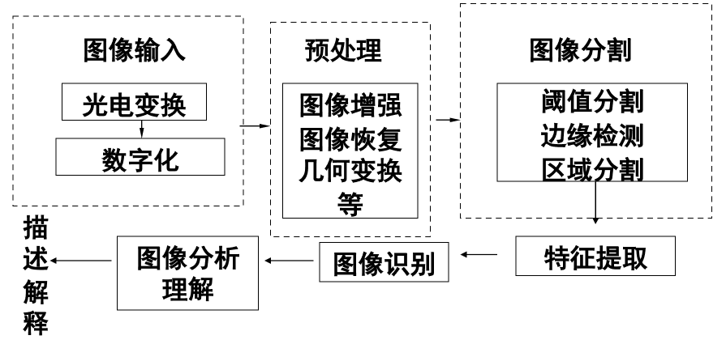
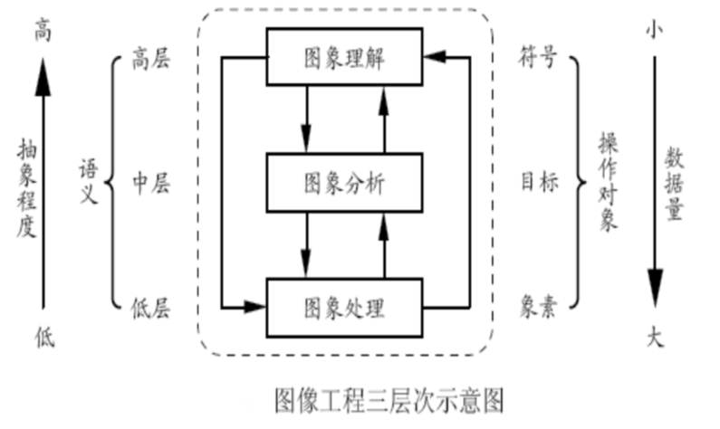

图像和图形的区别

- **图像**是一个大矩阵，每个位置都用像素表示
- **图形**是由指令构成，一条线，从起点到终点

- **图像空间分辨率** :
  - 指图像数字化的空间精细程度。
- **灰度级分辨率**：
  - 即颜色深度，表示每一像素的颜色值所占的二进制位数。颜色深度越大则能表示的颜色数目越多。

图像存储系统，一个重要方向是**压缩**

## 图像处理的目的

1. **提高图像的视感质量**，达到赏心悦目的目的
   1. 图像去除噪声，改变图像的亮度、颜色，增强图像中的某些成份、抑制某些成份，对图像进行几何变换等，从而改善图像的质量。
2. **提取图像中某些特征**，以便于分析。
   1. 常用作模式识别、计算机视觉的预处理等。这些特征包括很多方面，如频域特性、灰度／颜色特性、边界／区域特性、纹理特性、形状特性等。
   2. 把图像从**空间域**到**频域**
3. 图像识别
   1. 在分析的基础上，进行内容识别，例如：汽车牌照识别，人脸识别、虹膜识别、指纹识别等。
4. 对图像数据压缩，便于存储和传输。
   1. 提高存储量，提高网络的速度。

**图象处理是交叉边缘学科**：
是计算机、传感器、信息技术、信号处理、人工智能、模式识别、应用对象等的交叉学科和技术。
利用计算机对图像进行**去除噪声、增强、复原、分割、提取特征**等的理论、方法和技术称为数字图像处理。

## 一般的图像处理过程

## 数字图像处理技术

1. 图像获取、表示和表现
2. 图像复原
   1. 当造成图像退化（图像品质下降）的原因已知时，复原技术可以对图像进行校正。
   2. 关键是对每种退化都需要有一个**合理的模型**。
      1. 运动模糊图像，可以根据前后帧的内容进行模型补偿
   3. 复原技术是基于**模型和数据**的图像恢复，其目的是消除退化的影响，从而产生一个**等价于理想成像系统**所获得的图像。
3. 图像增强
   1. 并非是针对退化，只能通过试验和分析误差，**选择一种合适的方法**。
   2. 对自己感兴趣的部分，多次尝试，获取想要的特征
4. 图像分割
   1. 为达到识别和理解的目的，按照一定的规则将图像分割成区域（物体）。
   2. **人类视觉**系统将复杂场景中的对象分开，识别。但计算机视觉却是一个**难题**。 将各种方法融合，提高处理的可靠性和有效性是研究热点。
5. 图像分析
   1. 应用的目标几乎均涉及到图像分析，即分割、特征提取和表示，从而有利于计算机对图像进行分类、识别和理解。如医学图像处理，不仅要检测出物体（如肿瘤）的存在，而且还要检查物体的大小。
6. 图像重建
   1. 图像增强、图像复原输入是图像，处理后输出也是图像。
   2. 而图像重建与上述不同，**输入的是某种数据**，而经过处理后得到的**结果是图像**。
7. 图像压缩编码
   1. 数据量庞大，必需压缩。
   2. ① 减少数据存储量；② 降低数据率以减少传输带宽；③ 压缩信息量，便于特征提取，为后续识别作准备。

## 数字图像处理流程

(1) 图像处理阶段
(2) 图像分析阶段
(3) 图像理解阶段

### 图像处理阶段

在像素级上进行处理

- 几何校正；
- 灰度变换处理；
- 图像平滑处理；
- 图像锐化处理等。

### 图像分析阶段

对感兴趣的目标:

- 检测；
- 分割；
- 测量；
- 特征提取等。

分析的结果能为用户提供描述目标特点和性质的数据。

### 图像处理中常用技术

**点处理**：灰度变换。
**域处理**：主要有卷积、中值滤波和边缘检测
