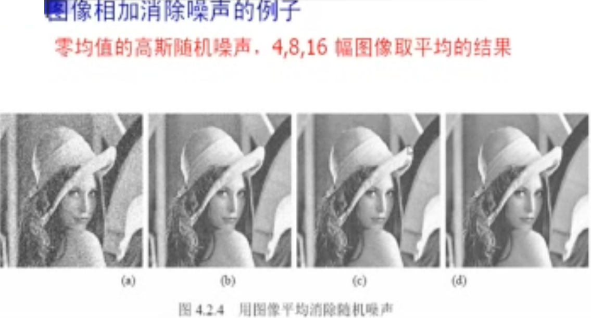

## 图像的差影法

拍摄图片时，往往是一个摄像头连续的拍照

### 基本理论

**代数运算**：对两幅输入图像进行**点对点**的加、减、乘、除计算而得到输出图像的运算。

- **相加作用**: 对同一场景的多幅图像求平均值，**降低随机噪声**的影响。
  - 假设噪声是独立分布的，且具有零均值，就可以通过多幅图像的相加来消除噪声。
  - 
- **相减作用**：去除一幅图像中不需要的图案，**检测运动**物体的目的。
- **相乘作用**: 可以遮住图像中的某些部分，仅留下感兴趣的物体。
- **相除作用**: 可产生对颜色和多光谱图像分析十分重要的比率图像。

## 图像的逻辑运算

图象间的运算指以图象为单位进行的操作，运算的结果是一幅新图象；图像由像素构成. 最终归结于像素间的运算
**对整幅图象的算术和逻辑运算是逐象素进行的，即在两幅图象的对应（位置）象素间进行**

一般是针对**二值图像**处理

- 与运算
- 或运算
- 非运算
- 或非运算
- 与非运算
- 异或运算
