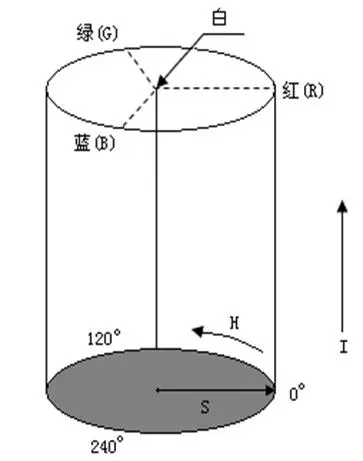
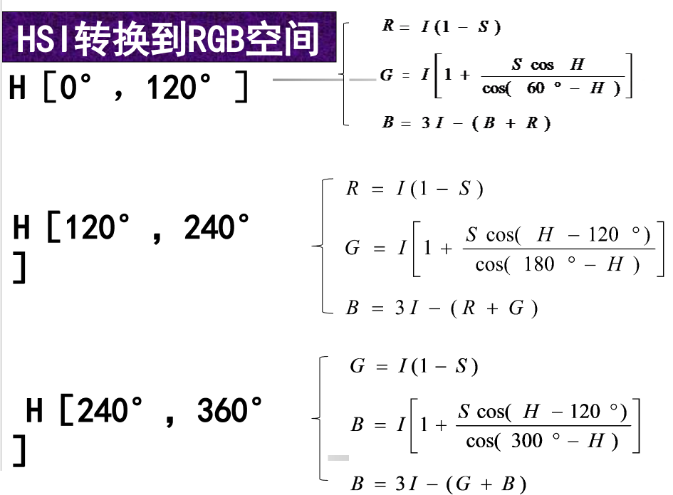
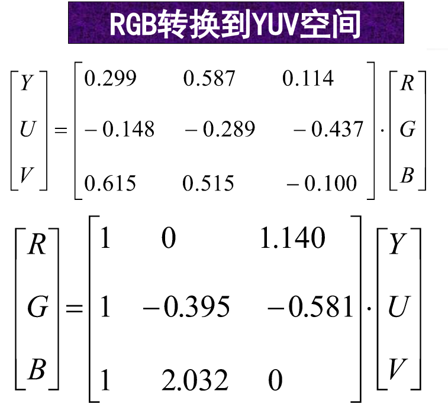
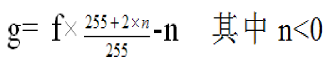
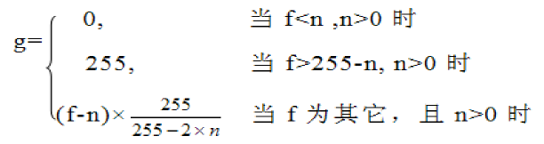
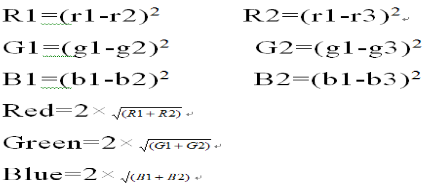

## 彩色图像的基本概念

**颜色模型**：科学地定量描述和使用颜色。常用：

- **RGB**：视频监视器、彩色摄像机。
  - 用三维空间中的一个点来表示一种颜色。每个点有三个分量，红、绿、蓝亮度值。
- **HSI**：以彩色处理为目的的应用，如动画中的彩色图形。
  - 反映了人的视觉系统观察彩色的方式，符合人的视觉感受，让人觉得更加直观一些。
  - 适合借助人的视觉系统来感知彩色特性的图像处理算法。
  - 在艺术上经常使用 HSI 模型。
- **CMYK**：印刷工业。
- **YUV**：电视信号传输。

### HSI 颜色模型

RGB 格式从物理和光学角度描述颜色不同，HSI 则是根据视觉的主观感觉对颜色进行描述

人眼不能直接感觉红、绿、蓝三色的比例，只能通过感知颜色的**亮度、色度和饱和度**来区分物体。

三个基本属性：色调、饱和度和亮度。
颜色模型 HIS：基于这三个基本属性。HSI 表征彩色信息的两个参数：色度（hue）和饱和度（saturation）。

- **亮度 (Intensity)** ：指光波作用于感受器所发生的效应，大小由物体反射系数决定，系数越大，物体亮度愈大，反之愈小。与图像的彩色信息无关。
- **色度 (Hue)** ：表明颜色种类，决定颜色本质，由物体反射光线中占优势的波长决定，不同波长产生不同的颜色感觉。
- **饱和度 (Saturation)** ：是指颜色的深浅和浓淡程度，饱和度越高，颜色越深。

#### HIS 色相环

色调：由角度表示该彩色最接近什么样的光谱波长。

0° 红色， 120° 绿色， 240° 蓝色。 0° 到 240° 覆盖可见光谱彩色，在 240° 到 300° 之间为人眼可见的非光谱色（紫色）。

饱和度：色环的圆心到半径的长度。环边界上饱和度值为 1，纯颜色。中心饱和度为 0，是灰色阴影。

**HSI 模型的三个属性定义了一个三维柱形空间**。灰度阴影沿着轴线从底部的黑变到顶部的白，具有最高亮度。最大饱和度的颜色位于圆柱上顶面的圆周
上。

对任何 3 个［0，1］范围内的 R、G、B 值，其对应 HSI 模型中的 I、S、H 分量的计算公式为

Ｈ是在［0°，360°］范围内。
当 S ＝ 0 时对应的是无色彩的中心点，这时 H 就没有意义，此时定义 H 为 0。
当 I ＝ 0 时，S 也没有意义。
设 S、I 的值在［0，1］之间，R、G、B［0，1］之间，HSI 转换为 RGB 的公式为：

### YUV 颜色模型

YUV 颜色模型 ：由 1 个亮度信号 Y 和两个色差信号 U、V 组成。

它是利用了人眼对亮度信号敏感而对色度信号相对不敏感的特点。

电视系统中常用的颜色模型。

RGB 转换到 YUV 空间

### CMYK 颜色模型

计算机屏幕显示通常用 RGB 表色系统，通过相加来产生其他颜色，加色合成法 (Additive Color Synthesis)。

在印刷工业上则通常用 CMYK 表色系统，通过颜色相减来产生其他颜色的，减色合成法 (Subtractive Color Synthesis)。

CMY 颜色模型 ：青色 (Cyan)、品红色(Magenta)、黄色 (Yellow) 和黑（Black）, 是红、绿、蓝的补色，称为减色基。是彩色图像印刷行业使用的彩色空间。

在处理图像时，一般不用 CMYK 模式，文件大，占用的磁盘空间和内存大。这种模式一般在印刷时使用。

### Lab 颜色模型

Lab 颜色由亮度或光亮度分量 L 和 a、b 两个色度分量组成。其中 a 在的**正向数值**越大表示越红，在**负向数值**越大则表示越绿；b 在的正向数值越大表示越黄，在负向的数值越大表示越蓝。

Lab 颜色与**设备无关**，无论使用何种设备（如显示器、打印机、计算机或扫描仪）创建或输出图像，这种模型都能生成一致的颜色。

### 位图深度

位图中记录每个像素点所占的位数，它决定了彩色图像中可出现的最多颜色数，或者灰度图像中的最大灰度等级数。

## 图像的颜色处理

### 彩色图像的灰度化处理

**灰度化处理**：是把含有亮度和色彩的彩色图像变换成灰度图像的过程

**处理方法**:

使 RGB 模型中颜色 R、G、B 分量值相等，即：R=G=B

1. $Gray (i, j)=0.11*R (i, j)+0.59*G (i, j)+0.3*B (i, j)$
2. 绿色所占比重最大，用 G 值为转换后的灰度。
3. 取三个分量的最大值、最小值、算术平均值等。

> 上面 3 种方式都可以，只要 3 个分量相等即可，一般推荐第一种

转换后的**灰度值越大越白**、越亮，越小越黑。

### 灰度图像着色处理

人眼对**灰度**的**分辨能力很差**，一般只有几十个数量级，灰度图像中，如果相邻像素点的灰度相差不大，包含丰富的信息，则无法从图像中提取相应的信息。

人眼对**彩色信号**的**分辨率很强**，将灰度图像转换为彩色图像，人眼可以提取更多的信息量。

由于 24 位灰度图像的**三分量值相等**，所以**改变对应的三个分量的值**，可得伪彩色图像。
通过调整红、绿、蓝的值而得到不同颜色效果的彩色图像。
若输入相等的分量值时，即得到不同亮度的灰度图像。

### 亮度调整

人眼对亮度是**非常敏感**的，在比较两个强弱不同亮度时，有较好的判断力。所以在图像的处理过程中，经常要对亮度和对比度进行调整。

**亮度调整**：指人眼亮度感觉的调整，可以通过对 R、G、B 颜色的增加或减少相同的增量来显示。

亮度调整：给每个分量乘以一个百分比值，这个值由对话框输入。三个颜色指针分别乘以一个百分比后再返回给原来的颜色分量。

① 当输入值为 100 时，保持原来亮度；
② 当输入值小于 100 时，亮度减少，变暗；
③ 当输入值大于 100 时，亮度增加。

### 对比度调整

**对比度**：是颜色分量之间的差值。

**调整对比度**：使图片的颜色之间更符合人们的需求，实现一些效果。
**低对比度**：整幅图偏暗，或整幅图偏亮，颜色都挤在一起，没有拉开。
**增加对比度**：把所感兴趣的颜色范围拉开，亮的越亮，暗的越暗，达到增强对比度的目的。

改变对比度就是对每一颜色分量以一致的方式来改变最大值和最小值之间的差值，要对每一个像素 RGB 分量的值都要进行调整。

从对话框获得调整参数 n（-127，128）之间。

1. 输入值为 0 时，保持原对比度；
2. 输入值小于 0 时，减少对比度。减少对比度变化的方法是：

**对分量的区间缩小，从 $[0,255]$ 减少到 $[-n, 255+n]$ 。**

3. 输入值大于 0 时，增加图像的对比度。增加对比度变化的方法是：

**对分量的区间扩大，把从 $[n, 255-n]$ 增加到 $[0,255]$ 。**

## 彩色图像的特效处理

- 彩色图像的**逆反**处理
- 彩色图像的**暴光**处理
- 彩色图像的**扩散**处理
- 彩色图像**马赛克**处理

> 还有一些灰度图像一样的处理方式就不写了，比如邻域平均法，线性滤波，图像锐化操作等

### 彩色图像的逆反处理

图像亮度逆反处理：对每个像素的三个分量值分别求逆反处理，即用 255 分别减去当前像素的三个分量值，而相减得到三个新值作为图像的

### 彩色图像的暴光处理

**曝光图像**：或多或少地损失了在原图像中可以看到的那些明快的颜色和色调。
**曝光图像算法**：逆转数值小于 128 的 R、G、B 三分量。
**曝光处理效果**：基于照片技术。

$G (i, j)= 255-f (i, j) ,\ 如果 \ f (i, j)<128$

### 彩色图像的扩散处理

**扩散处理**：不是基于像素的和或差，而是用 rand（）函数在图像中引入一些随机性，使图像如油画一般。

**方法**：从当前像素周围 5×5 相邻的像素中随机性的任意选择一个值作为当前像素的值。

### 彩色图像马赛克处理

**原理**：将图像从形式上划分为很多小块，在每块内的各个像素都取到相同的红、绿、蓝颜色值，从而对某些细节进行模糊化处理，使图像粗糙化。

**马赛克处理后**，图像每一小块矩阵内的所有像素值都取该矩阵内各像素值之和的平均值。

### 彩色图像的浮雕处理

**浮雕效果**：将变化部分突出，相同颜色部分则被淡化，使图像出现纵深感，从而达到浮雕效果。

**算法**：当前像素取值为与前一个像素的差值。颜色变化区才会出现色彩，颜色平淡区因差值几乎为零，变成黑色，加上一个常量增加亮度。

$G (i, j)= f (i, j)- f (i-1, j)+常量$ ，常量通常取值为 128，即

Red=R-r+128;
Blue=B-b+128;
Green=G-g+128;

### 彩色图像的霓虹处理

先计算原图像当前像素 f（i，j）的分量与其相邻像素 f（i+1，j）及 f（i，j+1）的梯度，即差的平方之和的平方根，然后将梯度值作为处理后像素的三个分量。

R 1 、g 1、b 1 分别为原图像像素 f (i, j) 分量值。
R 2 、g 2、b 2 分别为原图像同行相邻像素 f (i+1, j) 的分量值。
R 3 、g 3、b 3 分别为原图像同列相邻像素 f (i, j+1) 的分量值。
