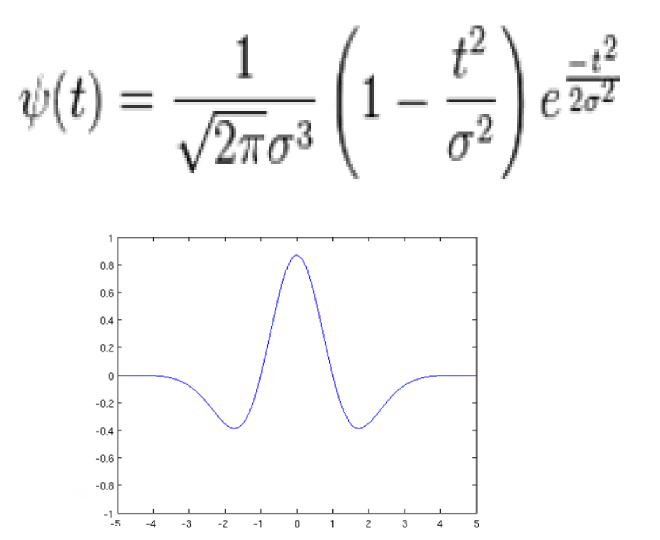
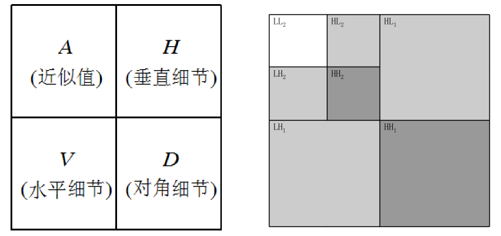

## 小波变换的基本概念

**信号分析**：获得时间和频率之间的相互关系。

傅立叶变换：提供频率域的信息，但有关时间的局部化信息却基本丢失。

**小波变换**：**缩放**母小波的宽度来获得信号的**频率特征**，**平移**母小波来获得信号的**时间信息**。缩放和平移操作是为了计算小波系数，**小波系数反映了小波和局部信号之间的相关程度。**

小波 (Wavelet)，“小波”就是小区域、长度有限、均值为 0 的波形。

所谓“小”是指它具有**衰减性**；而称之为“波”则是指它的**波动性**，其振幅正负相间的**震荡形式**。

### 墨西哥帽小波

离散小波变换将一幅图象分解为大小，位置和方向都不同的分量。一个图像作小波分解后，可得到一系列不同分辨率的子图像，小波变换正是沿着多分辨率这条线发展起来的。

一幅地图的尺度是地域实际大小与它在地图上表示的比值，地图通常以不同尺度来描述.

小波变换进行图像分解

**与 Fourier 变换相比**:小波变换是时间 (空间) 频率的局部化分析，它通过**伸缩平移**运算对信号 (函数) 逐步进行多尺度细化，最终达到**高频处时间细分，低频处频率细分**，能自动适应时频信号分析的要求，从而可聚焦到信号的任意**细节**，解决了
Fourier 变换的困难问题，成为继 Fourier 变换以来在科学方法上的重大突破。有人把小波变换称为“**数学显微镜**”。

- **小波**：一类在有限区间内快速衰减到 0 的函数，平均值为 0，小波趋于不规则、不对称。
- **正弦波**：从负无穷一直延续到正无穷，平滑而且可预测的。
- **小波和正弦波形状看出**：变化剧烈的信号用**不规则的小波分析比用平滑的正弦波更好**，用小波更能描述信号的**局部**特征。

## 连续小波变换

**连续小波变换**（Continuous Wavelet Transform， CWT）：

**小波变换**：信号 f (x) 与被缩放和平移的小波函数 ψ() 之积在信号存在的整个期间里求和的结果。CWT 的变换结果是小波系数 C，这些系数是缩放因子）和平移的函数。

### 一维连续小波变换

**缩放**：压缩或伸展基本小波，缩放系数越小，则小波越窄。

**平移**：小波的延迟或超前。在数学上，函数 f(t)延迟 k 的表达式为 f(t-k)。

### 小波变换—步骤

CWT 计算主要有如下**五个步骤**：

1）取一个小波，将其与原始信号的开始一节进行比较。
2）计算数值 C，C 表示小波与所取一节信号的相似程度，计算结果取决于所选小波的形状。（和傅立叶变换类似，相似程度越高，值越大）
3）向右移动小波，重复第一步和第二步，直至覆盖整个信号。
4）伸展小波，重复第一步至第三步。
5）对于所有缩放，重复第一至第四步。

**小波的缩放因子与信号频率之间的关系**：
缩放因子 scale 越小，表示小波越窄，表示信号频率越高, 度量的是信号的细
节变化；缩放因子 scale 越大，表示小波越宽，表示信号频率越低, 度量的是信号的粗糙程度。

**双通道子带编码**: 原始的输入信号，通过两个互补的滤波器组。

1. 低通滤波器，通过该滤波器可得到信号的近似值 A；
2. 高通滤波器，通过该滤波器可得到信号的细节值 D。

**近似值**: 是大的缩放因子计算的系数，表示信号的低频分量，
**细节值**: 是小的缩放因子计算的系数，表示信号的高频分量。
实际应用中，信号的低频分量往往是最重要的，而高频分量只起一个修饰的作用。

小波变换: 可以表示成**由低通滤波器和高通滤波器组成的一棵树**。原始信号经过一对互补的滤波器组进行的分解称为一级分解，可以进行多级分解。
**信号的多分辨率分析**: 如果对信号的高频分量不再分解，而**对低频分量进行连续分解**，就可以得到信号不同分辨率下的低频分量。

在每个缩放因子和平移参数下计算小波系数，计算量大，数据多，还有许多无用数据。选择部分缩放因子和平移参数来进行计算，会使分析的数据量减少。
双尺度小波变换：如果缩放因子和平移参数都选择为 2 j（j>0 且为整数）的倍数，在每个通道内（高通和低通通道）**每两个样本数据取一个**，可得离散小波变换的系数。

### 小波分解

小波分解：具体实现过程可以分别设计高通滤波器和低通滤波器，得到高频系数和低频系数，并且每分解一次数据的长度减半。

利用各层系数进行信号分解过程，是将信号通过一系列的不同类型的滤波器，从而得到不同频率范围内的信号，及将信号分解。

### 小波重构

**小波重构**：利用信号的小波分解的系数还原出原始信号（IDWT）。为分**分解的逆过程，先进行增采样，及在每两个数之间插入**一个 0，与共轭滤波器卷积，最后对卷积结果求和。

在应用程中，利用各层系数对信号进行重构（注意虽然系数数少于原信号点数，但是重构后的长度是一样的），从而可有选择性地观看每一频段的时域波形，确定冲击成分所在频率范围。

## 离散小波变换

### 二维离散小波变换

**二维离散小波变换**：是一维离散小波变换的推广，是将二维信号在不同尺度上的分解，得到原始信号的近似值和细节值。由于信号是二维的，因此分解也是二维的。分解的结果为：**近似分量、水平细节分量、垂直细节分量和对角细节分量。**

### 用小波变换进行图像分解

使用小波变换完成图像分解的方法很多，例如，均匀分解、非均匀分解、八带分解、小波包分解等。

**八带分解**：把低频部分分解成比较窄的频带，而对每一级分解得到的**高频部分不再**进一步进行分解。

### 小波去噪

使用小波分析可以将原始信号分解为一系列的**近似分量和细节分量**，信号的**噪声**主要集中表现在信号的**细节分量**上。使用一定的阈值处理细节分量后，再经过小波重构就可以得到平滑的信号。

方法：

- **硬门限**：当数据的绝对值小于给定的门限时, 令其为零, 而数据为其他值时不变。
- **软门限**: 当数据的绝对值小于给定的门限时, 令其为零, 然后把其他数据点向零收缩。

图像增强问题主要通过空域和频域处理两种方法。

- **空域法**：方便快速，但会丢失很多点与点之间的相关信息。
- **频域法**：详细地分离出点之间的相关性，计算量大。基于原始图像尺度上所有点的变换，但对于问题本身的要求，不需要这么大的分辨率，而单纯的空域分析又显得太粗糙。
- **小波变换**: 是一种时间－尺度分析方法，而且具有多分辨率的特点，在处理时所进行的是空域和频域的局部变换。

小波变换不同于傅立叶变换，小波系数于原始图象存在着空间上的对应关系，因此对于滤波处理十分有利，通过了解小波系数的分布情况，利用不同的滤波器处理小波系数，经过逆变换后可以得到理想的处理结果。

一般的傅里叶算法，一般可以是 IIR 滤波和 FIR 滤波。两者各有优缺点。而小波的消噪，一般也是由多层分解和阈值策略组成。

需要了解信号的特点，噪声的特点，然后确定用不用小波，或用什么小波。这点上，小波的优势并不是很明显。

### 小波压缩

压缩是小波最大的优势。小波包是从频域上实现的。从时域上，我们也可采用类似的分裂和并算法，来实现信号最优的表达。

傅里叶变换的压缩，已经广泛应用了。简化版本就是 DCT 变换。而小波包的提出，也就使 DCT 有些相形见拙。

**傅里叶变换**：用正弦函数的和来表示，只在频域上是局部的
**短时傅里叶变换** (STFT) 也是时域和频域都局部化的. 但有些频率和时间的分辨率问题。
小波：在时域和频域都是局部的。通常通过**多分辨率分析**给出信号更好的表示。

对于**平稳信号**，傅里叶再好不过了。它反映的是信号总体的整个时间段的特点。在频率上，是点频的。
对于**非平稳信号**，它就无能为力了。而小波恰好对此派上用场。小波是反映信号，某个时间段的特点的。在频域上，是某个频率段的表现。但小波，作为频谱分析确实存在很多问题。

### 离散小波的种类

Beylkin
Coiflet
多贝西小波 (Daubechies 小波)
Cohen-Daubechies-Feauveau 小波，
哈尔小波转换
Vaidyanathan 滤波器
Symmlet
复小波变换

### 连续小波变换种类

墨西哥帽小波
厄尔米特小波
厄尔米特帽小波
复墨西哥帽小波
Morlet 小波
修正 Morlet 小波
Addison 小波
希尔伯特-厄尔米特小波

## 小波变换编程实现

小波做分解时，一个做高通，一个做低通。低通保存近似值，高通保存细节

1. 对图像进行小波 n 次变换；
2. 将 LL 区的数据删除（置 128，校正亮度），其余保持不变；
3. 进行小波 n 次逆变换。
   

## 小波重构
