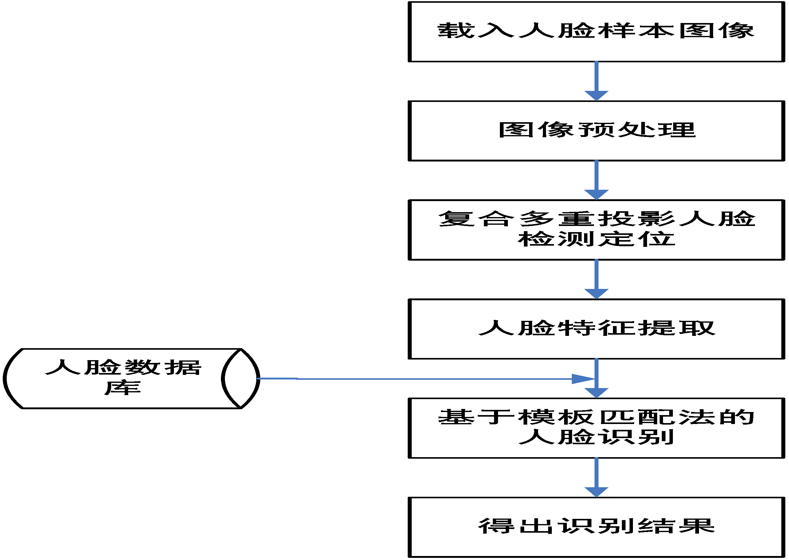
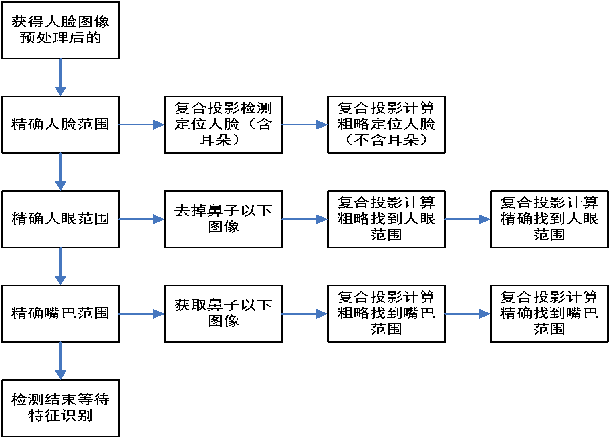
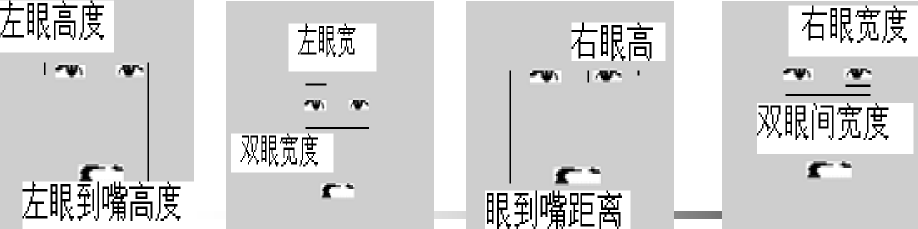
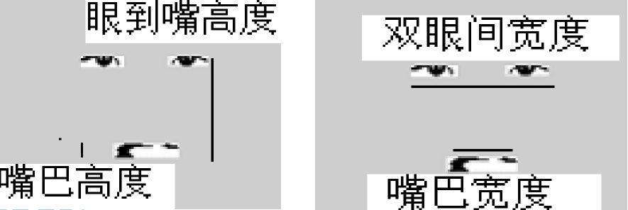

人脸识别技术：通过计算机提取人脸特征，并根据这些特征进行身份验证的一种技术。

人脸识别技术是一门涵盖多门学科的应用技术，它涉及信号处理、数字图像处理、计算机视觉、模式识别、人工智能等多门学科。

在样本获取方面，获得高质量的人脸图像比获取同样质量的指纹等图像更容易方便。因此人脸识别技术比其它生物特征识别方法有更多的优越之处。

完整流程图

采用**多重投影法**对二值化后的图像进行处理。

（1）通过**分析投影曲线**的特征，进行脸部的**粗定位**。
（2）在检测到的脸部区域内进行人脸特征定位，包括眼部和嘴部的定位。

### 特征提取

对待测人脸图像提取的特征共有 6 个：

左眼高比（左眼高度与左眼到嘴巴距离比）；
左眼宽比（左眼宽度与左眼到右眼宽度比）；
右眼高比（右眼高度与右眼到嘴巴高度比）；
右眼宽比（右眼宽度与左眼到右眼宽度比）
嘴高比（嘴巴高度与嘴巴到人眼高度比值）；
嘴宽比（嘴巴宽度与左眼到右眼宽度比值）。

### 识别的具体实现 ：

（1）从 data. Dat 样本数据库中调出所有样本的特征值（每类样品图像包含 6 个特征值，包括左眼宽比、左眼高比、右眼宽比、右眼高比、嘴巴宽比、嘴巴高比）；
（2）提取出待测人脸图像样本的六个特征值；
（3）将待测人脸样品 X 与人脸样品数据库中已知 Xi 的
进行判别： |X- Xi| /|X|<0.05；
（4）找出与人脸图像数据库中样品最接近的，相似度满足小于 0.05，系统确认识别成功，将待测人脸图像特征加入数据库。否则识别失败。
