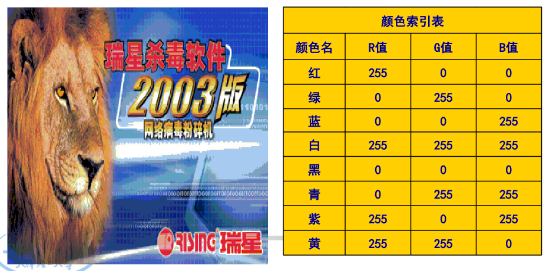

## 图像的存储格式

按照颜色深度分类, 常用图像文件:

- 黑白图像
- 8 位索引图像
  - 一个数据矩阵 x 和一个调色板矩阵 MAP。数据矩阵里面的每一个像素信息对应索引号，找到对应的 RGB 分量
  - (1) 文件带有图像颜色索引表。`fred (x, y)=fgreen (x, y)= fblue (x, y)` 经过换算
  - (2) 像素值是图像颜色表的索引地址。由 8 位组成，从 0~255. 对于黑白图片来说，各个**分量相等**，索引号就是他的颜色浓度
  - 8 位伪彩色索引图像
    - (1) 颜色表红、绿、蓝分量值**不全相等**。
    - (2) 像素值是图像颜色表的索引地址
    - 
- 24 位真彩色图像（红绿蓝各 8 位）
  - 没有调色板矩阵，直接对应 RGB 颜色的值
-

### 图像显示流程图

只有伪彩色，灰度图像 8 位索引有调色板


### 图像文件格式

1. **BMP**（BitMaP）格式
2. GIF（Graphics Interchange Format）格式
   1. GIF 主要用于不同平台上交流和**传输**，而**不是作为文件**的存储格式。 最大不能超过 64 M， 颜色最多为 256 色。
3. TIFF（Tagged Image Format File）格式
   1. TIF 文件的设计考虑了扩展性、方便性和可修改性，是**最复杂**的一种。要求用更多的代码来控制它，结果导致文件读写**速度慢, 代码长**。
4. JPEG（Joint Photographic Expert Group）格式

## BMP 文件存储格式

### BMP 文件组成

- 位图**文件头**结构 BITMAP**FILE**HEADER
- 位图**信息头**结构 BITMAP**INFO**HEADER
- 位图**颜色表** RGBQUAD
- 位图像素**数据**

```cpp
// 位图文件头 总大小 14 Byte
typedef struct tagBITMAPFILEHEADER
{
 WORD bfType; // BM 文件标识符
 DWORD bfSize;// 文件大小
 WORD bfReserved1;// 0
 WORD bfReserved2;// 0
 DWORD bfOffBits; //位图数据的起始位置，
}BITMAPFILEHEADER;

// 位图信息头
typedef struct tagBITMAPINFOHEADER
{
 DWORD biSize; // 本信息头的大小 40 Byte
 LONG biWidth;
 LONG biHeight;
 WORD biPlanes; // 位平面数，标准的一般是 1
 WORD biBitCount； // 每个像素所需的位数,
 DWORD biCompression; // 位图压缩类型， 不压缩
 DWORD biSizeImage; // 位图的大小，
 LONG biXPelsPerMeter; // 标准为0
 LONG biYPelsPerMeter; // 标准为0
 DWORD biClrUsed; // 颜色数，自定义需要添加，一般为0
 DWORD biClrImportant; // 重要的颜色数，一般为0
} BITMAPINFOHEADER;

// 颜色表
typedef struct tagRGBQUAD
{
BYTE rgbBlue;// 蓝色
BYTE rgbGreen; // 绿色
BYTE rgbRed; // 红色
BYTE rgbReserved;// 0，保留字段
} RGBQUAD;

// 位图信息-- BITMAPINFO结构
// 显示语句
struct tagBITMAPINFO
{
 BITMAPINFOHEADER bmiHeader;
 RGBQUAD bmiColors[1]; // 颜色表
} BITMAPINFO;
```


