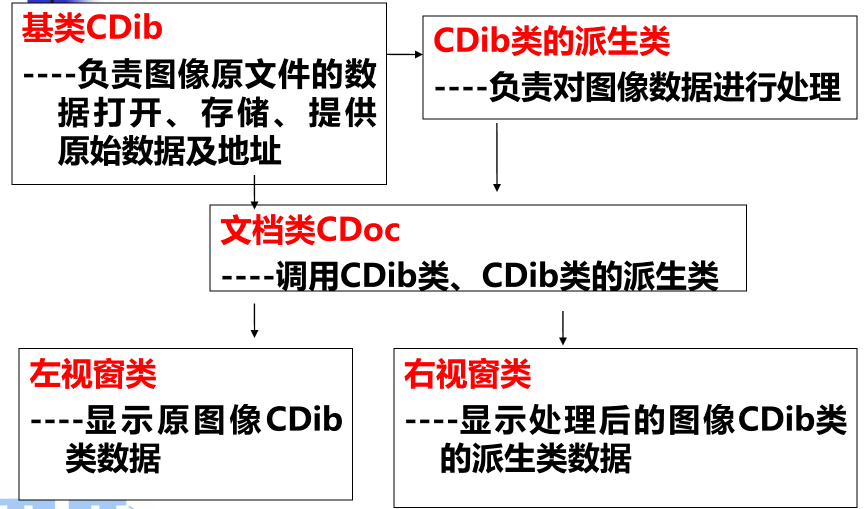

从底层实现图像变换的操作

### CDib 类库功能

①DIB 文件的读、写操作；
② 提供位图宽度、高度、颜色数目等；
③ 提供有关位图占据内存空间的信息，包括：图像数据区**首地址**、颜色表**首地址**、位图信息结构**首地址**等。

> [!NOTE] 课堂作业
> 原本的作业是在 vc++ 6.0 的编程软件内基于教学软件 VC_DIP 实现，现在都用 openCV 了，我后面的学习培养方案里是 python 和 pyQt。
> 所以，我用 opencv 的 python 3 实现同样的图像特效
