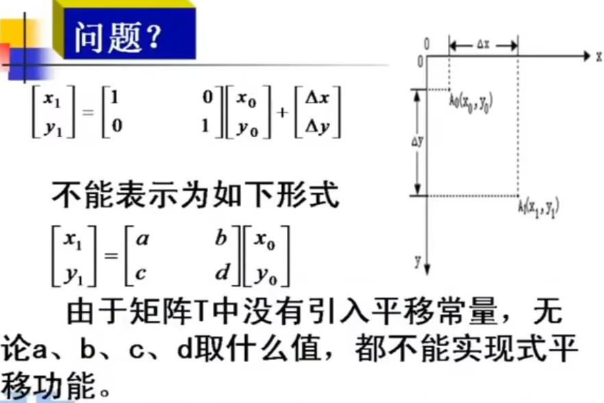
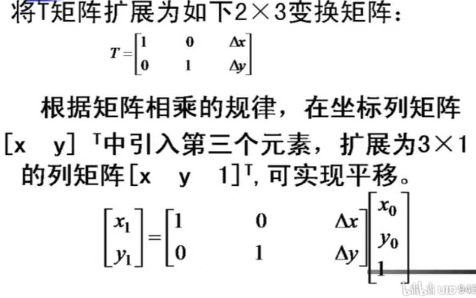
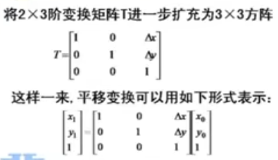
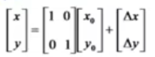
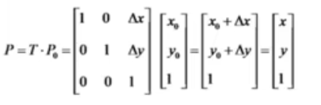
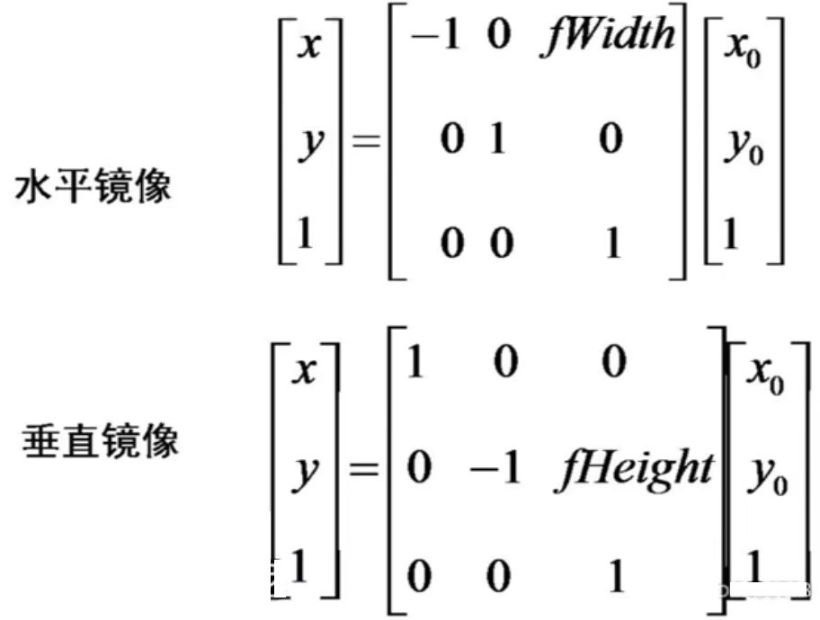
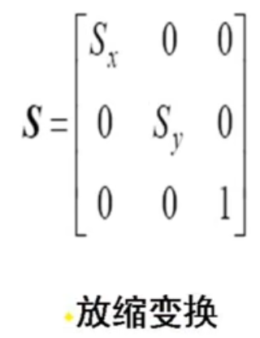
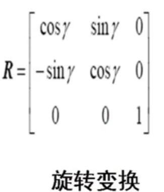

## 几何变换基础

用**统一**的矩阵线性变换形式，表示和实现几何变换，引入**齐次坐标**。**采用齐次坐标可以实现上述各种几何变换的统一表示**。

#### 齐次坐标

以 n+1 维向量表示 n 维向量的方法称为齐次坐标表示法。
齐次坐标的**几何意义**相当于点（x，y）**投影**在 xyz **三维立体空间**的 z=1 的平面上。

再进一步扩充为 `3x3` 矩阵

2 D 图像几何变换的一般过程

- 变换矩阵 T 利用齐次坐标及改成 3×3 阶形式.
- 将 2×n 阶的二维点集矩阵表示成齐次坐标 3×n 阶的形式.
- 乘以相应的变换矩阵。

**变换后的点集矩阵=变换矩阵 $T$ X 变换前的点集矩阵**

### 图像的平移

变成通用的表示方法，用一个变换方程表示

**注意，画布也要放大，否则会丢失信息**

### 图像的镜像变换

总宽度减去当前宽度的位置

### 图像的缩放

### 图像的转置

长宽可能会发生变换

### 图像的旋转

进行该操作，因为不是整数操作，需要一些差值，补充空白的像素点

## 复合变换

对给定的图像连续施行若干次如前所述的平移、镜像、比例、旋转等基本变换 $F_1，F _2，..，F_N$ 后，所完成的变换。
**复合变换的矩阵等于基本变换的矩阵按顺序依次相乘得到的组合矩阵**，又叫级联变换。 $T=T_NT_{N-1}.. T_1$ 。
**若干次基本变换仍可用 3×3 阶表示**。
