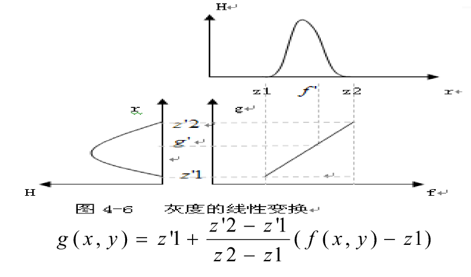
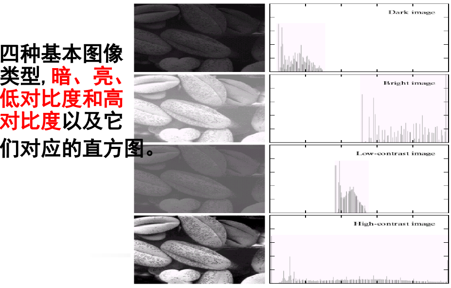

# 图像增强

- 图象不清晰、不突出是多种因素造成的：采集中未突出所需部分，有干扰（噪音、散斑、运动模糊等等）。
- 目标是比原图像更适合于特定的应用，便于识别，人工或后继处理。
- 不同的问题适合采用不同的方法，评价结果好坏没有统一的标准。

- **图像增强**：不考虑降质原因，关心有用信息，抑制次要部分，去干扰，增强对比度。不一定要去逼近原图像。
- **复原技术**：针对降质原因，设法补偿降质因素，尽可能逼近原始图像，恢复原图。
- **二者有重叠部分**：增强带有恢复性质，突出有用信息上，且是局部性恢复。

- 图像增强的主要内容
  - 空间域
    - **灰度变换** （本节课）
      - 直接灰度变换
      - 直方图修正法
        - 直方图均衡化
        - 直方图规定化
      - 图像的代数运算
    - 空域滤波
      - 图像平滑 [[5-图像的平滑处理)
      - 图像锐化
  - 频率域
    - 高通滤波
    - 低通滤波
    - 带通、带阻滤波

## 图像灰度变换

按一定变换关系，**逐点**改变原图像中每一个像素灰度值的方法。
是图像增强处理技术中一种非常基础、直接的**空间域**图像处理方法。
目的是为了改善画质，使**图像的显示效果更加清晰**。

### 点运算

输入图像为 f (x ,y), 输出图像为 g (x ,y) 点运算为： $g (x ,y)=T[f (x, y)]$ 是一种像素的**逐点运算**。描述了输入和输出值之间的转换关系。不改变空间位置关系。
点运算又称为“**对比度增强**”、“**对比度拉伸**”、“**灰度变换**”。

## 灰度变换

### 灰度线性变换

输出灰度级与输入灰度级呈线性关系的点运算。

从一个区间拉伸到另一个区间，非齐次线性变换。类似相似三角形计算过程

#### 反转变换

$g(x,y) = 255 - f(x,y)$

#### 分段线性变换

为了突出感兴趣的区间，抑制不感兴趣区域，可采用分段线性变换。

### 非线性变换

#### 灰度对数变换

**对原图像的动态范围进行压缩**

较暗的区域提升，较亮的区域压缩

#### 灰度指数变换

更好相反

还有其他的一些变换

## 二值化和阈值处理

经过阈值处理后的图像变成了一幅黑白二值图。

双固定阈值法

## 灰度直方图

灰度直方图表示图像中具有某种**灰度级**的像素的**个数**，反映了图像中每种灰度出现的**频率**。它是图像**最基本的统计特征**。
**横坐标**：灰度级；
**纵坐标**：该灰度级出现的个数。

从图像灰度级的分布可以看出一幅图像的灰度分布特性。 (a) 较暗；(b) 偏亮。

### 直方图性质

1）只反映该图像中不同灰度值出现的次数（或频数），而未反映某一灰度值像素所在位置。**丢失了位置的信息。**
2）图像与直方图之间是**多对一**的映射关系。
3）由于直方图是对具有相同灰度值的像素统计得到的，因此，一幅图像**各子区的直方图之和等于该图像全图的直方图。**

### 直方图计算

1）初始化： $p［k］=0; k=0, …, L-1$ 。
2）统计： $p［f (x, y)］++ ;  X, y =0, …, M-1, 0, …, N-1$ 。
3） 归一化： $p (x, y)= p (x, y)/ M*N$ 。

## 直方图均衡化

经变换后得到的新直方图**不很平坦**，但比原始图像的直方图**平坦的多**，扩展了**动态范围**。对于**对比度较弱**的图像进行处理很有效。

变换后的**灰度级减少**，这种现象叫做“**简并**”现象。由于简并现象的存在，处理后的灰度级总是要减少。

1）统计直方图数组，用一个数组 p 记录 $p[i]$ 。
2）i 从 1 开始，令 $s[i]=s[i-1]+p[i]$ 。
一个数组 L 记录新的 s 索引值，即令 $L[i]=s[i]*(256-1)$ 。
3）依次循环每一个像素，取原图的像素值作为数组 L 的下标值，取该下标对应的 L 数组值为均衡化之后的像素值。
