图像在获取、传输过程中，受干扰的影响，会产生**噪声**，噪声是一种错误的信号，干扰正常信号。造成图像毛糙，需对图像进行**平滑处理**。
图像去噪是一种信号滤波的方法，目的是**保留有用信号，去掉噪音信号**。

噪声干扰一般是**随机**产生的，分布不规则，大小也不规则。噪声像素的灰度是空间不相关，**与邻近像素显著不同**。

### 平滑目的

1. **模糊**：在提取较大目标前, 去除太小的细节，或将目标内的**小间断连接**起来。
2. **消除噪声**：改善图象质量，降低干扰。平滑滤波对图像的**低频分量**增强，同时削弱高频分量，用于**消除图像中的随机噪声**，起到**平滑**作用。

**空间域法**：在原图像上直接对像素的灰度值进行处理。分为两类，**点运算和局部运算**（邻域有关的空间域运算）。
**频域法**：在图像的**变换域**上进行处理，增强感兴趣的频率分量，然后进行**反变换**，得到增强了的图像。

## 空间域滤波增强技术

- 基于像素的**点处理**
- 基于**模板**的空域滤波
  - 图像平滑 去噪音
  - 突出轮廓 图像锐化

### 图像平滑处理技术

**邻域处理方法**：用某一**模板**对每个像元与其**周围邻域**的所有像元进行某种数学运算，得到该像元新的灰度值。**新的灰度值**不仅与该像元的灰度值有关，还与其邻域内的像元的灰度值有关。

### 邻域处理---模板

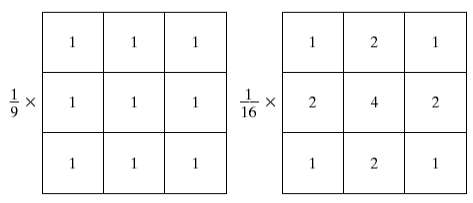

### 平滑处理的基本方法

1. **线性平滑**：每一个像素的灰度值用它的邻域值代替，邻域为 N×N，N 取奇数。
2. **非线性平滑**：改进，取一个**阈值**，当像素值与其邻域平均值之间的差**大于阈值**，**以均值代替；反之取其本身值。**
3. **自适应平滑**：**物体边缘**在不同的方向上有不同的统计特性，即不同的均值和方差，为保留一定的边缘信息，采用自适应法。

- 邻域平均法：
  - 邻减少噪音的同时，损失了高频信息。
- 邻域加权平均方法
- 选择式掩模平滑
  - **如何选择邻域的大小、形状和方向。如何选择参加平均的点数以及邻域各点的权重系数等。**
- 中值滤波：
  - 既消除噪声又保持图像的细节，可以消除孤立的噪声点

### 空域卷积滤波

空域卷积滤波借助**模板操作**。
模板操作：
是数字图像处理中常用的一种运算方式，图像的平滑、锐化以及后面将要讨论的细化、边缘检测等都要用到模板操作。

### 模板

**模板**：所有系数都是正的。也叫**滤波器、掩模、核或窗**。与邻域有相同维数。

**邻域平均模板所有系数都为 1** 。

星号表示为中心元素，将要处理的元素。将原图中一个像素的灰度值和相邻近的 8 个像素值相加，平均值作为中心值。

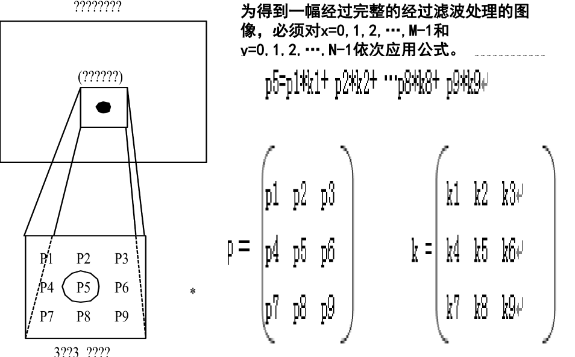

模板操作
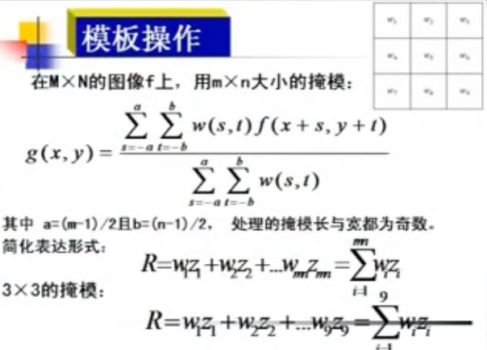

### 卷积运算

**卷积就是作加权求和的过程**。**卷积核**就是模板模板，大小与邻域相同。
邻域中的每个像素分别与卷积核中的每一个元素**相乘**，**求和**结果即为中心像素的新值。卷积核中的元素称作加权系数（卷积系数），系数的大小及排列顺序，决定了处理的类型。改变加权系数与符号，影响新值。

**邻域运算**：即某个像素点的结果不仅和**本像素灰度**有关，而且和其**邻域点**的值有关。
**模板运算**的数学含义是**卷积运算**。
**卷积**是一种用途很广的算法，可用卷积来完成各种处理变换。

### 边界问题

当在图像上移动模板（卷积核）至图像的**边界**时，在原图像中**找不到**与卷积核中的加权系数相对应的 9 个像素，即**卷积核悬挂**在图像缓冲区的边界上，这种现象在图像的**上下左右四个边界**上均会出现。

解决办法：

1）**忽略图像边界数据**；多采用该方法。
2）在图像四周复制原图像边界像素的值，从而使卷积核悬挂在图像四周时可以进行正常的计算。
3）计算出来的像素值的超出范围问题，对此可简单地将其值置为 0 或 255。

### 卷积步骤

1. 将模板在图中**漫游**，并将模板**中心**与图中某个像素位置**重合**；
2. 将模板上系数与模板下对应像素相乘；
3. 将所有**乘积相加**；
4. 将和赋给图中对应模板中心位置的像素。

## 噪声消除法

本节介绍对于**二值图像**上噪声的消除方法。

- **二值图像的黑白点噪声滤波**
- **消除孤立黑像素点**

### 实现步骤

1）取得图像大小、数据区，并把数据区复制到缓冲区中；
2）循环取得各点像素值；
3）取得该点周围 8 像素值的平均值；
4）平均值与该点像素值相比，若大于 127.5 则把该点颜色反转；

在二值图像中，消除孤立于周围的黑像素点 (变成白的)。

```
    *     * *  *
 *  *   *  *
    *     * *  *
  四邻域  八邻域
```

在 4 点邻域的情况下，若黑像素 `f (i，j)` 的**上下左右 4 个像素全为白**，则 `f (i，j)` 为白。在 8 点邻域法相似。

## 邻域平均法 (均值滤波)

一幅图像往往受到各种噪声的干扰, 噪声常为一些**孤立的像素点**，往往是叠加在图像上的**随机噪声**, 像**雪花**使图像被污染，而**图像灰度应该相对连续变化**的，一般**不会**突然变大或变小，这种噪声可以用**邻域平均法**使它得到抑制。

### 存在的问题

邻域平均法: 通过一点和邻域内像素点求平均来去除突变的像素点，优点是算法简单，计算速度快，代价是会造成图像一定程度上的**模糊**。

如果窗口内各点的噪声是独立等分布的，经过这种方法平滑后，**信噪比**可提高 $\sqrt{MN}$ 倍。在此算法中，**M, N 的值不宜过大**，因为 M, N 值的大小对速度有直接影响，且 **M, N 值越大变换后的图像越模糊**, 特别是在边缘和细节处。

### 改进的方法在：

如何选择邻域大小、形状和方向？
如何选择参加平均的点数？
如何选择邻域各点的权重系数等？

## 邻域加权平均法

也属于空域滤波增强算法，它是利用模板卷积的方法实现对原图的滤波，可表示为：

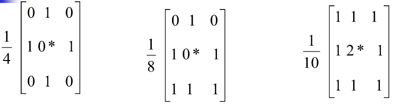

这些模板中引入了加权系数，以区分邻域中不同位置像素对输出像素值的影响，常称其为加权模板。

**Gaussian 离散模板**也是一种加权模板，并且它是按二维正态分布进行加权的。
也是一种常用的低通卷积模板。有着一些良好的特性。

### 超限邻域平均法

以某个灰度值 T 作为阈值，如果某个像素的**灰度大于其邻近像素的平均值，并超过阈值**，用平均灰度置换。

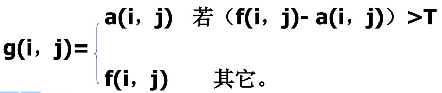

### N×N 均值滤波器

在本程序中当灰度图像 f 中以像素 f (i，j) 为中心的 N×N 屏蔽窗口 (N=3，5，7…) 内平均灰度值为 a 时，无条件作 f (i，j)=a 处理，N 由用户给定，且取 N 值越大，噪声减少越明显。
但平均是以图像的模糊为代价的。

### 选择式掩模平滑

选择式掩模平滑法制作 **9 种形状的屏蔽窗口**，取 5×5 窗口。在窗口内以中心像素 f (i, j) 为基准点，分别**计算**每个窗口内的**平均值及方差**，采用**方差最小**的屏蔽窗口进行平均化。

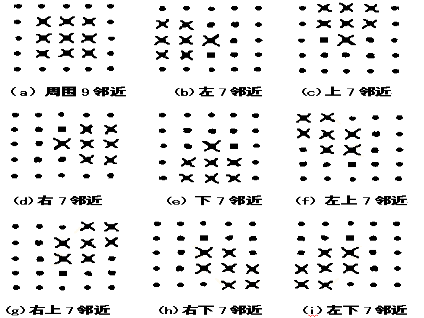

### 自适应平滑方法

由于含有尖锐边沿的区域，方差比平缓区域大, 采用多种形状的屏蔽窗口，分别计算各窗口内的灰度值方差，并采用方差最小的屏蔽窗口进行平均化方法。这种方法在完成滤波操作的同时，又**不破坏区域边界的细节**。

因为最终目的是消除噪声

## 中值滤波

**中值滤波**: **抑制噪声又要保持细节**。将窗口中**奇数个数**据按大小顺序**排列**, 处于**中心位置**的那个数作为处理结果。

是一种非线性信号处理方法，1971 年提出应用在一维信号分析中，被图像信号处理引用。在一定条件下，**克服线性滤波器（如邻域平滑滤波等）的模糊，对滤除脉冲干扰及图像扫描噪声最为有效**。不需要统计特性，方便。但是对一些细节多，特别是点、线、尖顶细节多的图像不宜采用中值滤波。

### 中值滤波法

设有一个一维序列 $f_1, f_2, …, f_n$ ，取**窗口长度 m**（**m 为奇数**），对其进行中值滤波，就是从输入序列中相继抽出 m 个数，再将这 m 个点按其数值大小排序，取其**序号为中心点的那个数**作为滤波输出。

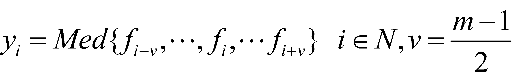

中值滤波就是用一个**奇数点的移动窗口**，将窗口**中心点的值**用窗口内各点的**中值代替**。假设窗口内有五点，其值为 200、80、 90 、110 和 120，那么此窗口内各点的中值即为 110。平均滤波为 120.
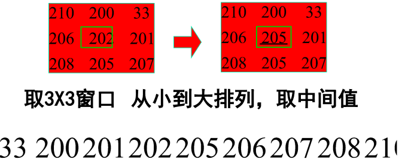

中值滤波器不影响**阶跃**函数和**斜坡**函数。**周期小于 m/2**（窗口之半）的**脉冲**受到抑制，另外
**三角函数的顶部变平**。

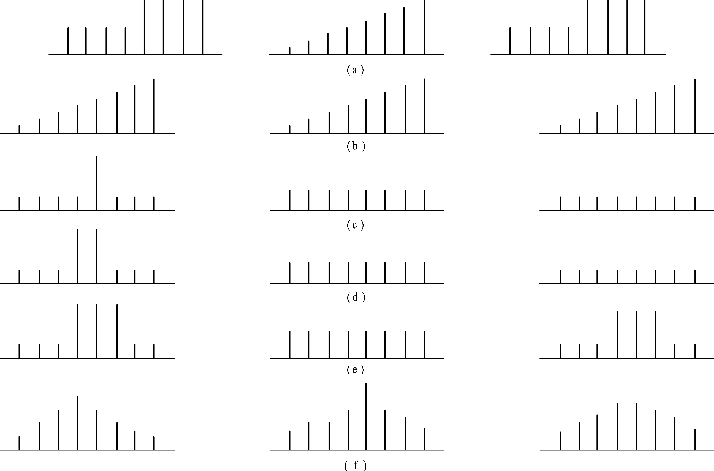
平均值滤波和中值滤波比较
a 阶跃；b 斜坡；c 单脉冲；d 双脉冲；e 三脉冲；f 三角波

二维中值滤波的窗口形状和尺寸对滤波效果影响较大，不同的图像内容和不同的应用要求，往往采用**不同的窗口形状和尺寸**。窗口尺寸：**先用** 3×3，**再取** 5×5 逐渐增大，直到满意。

> 窗口越大，对脉冲周期短的信号不利

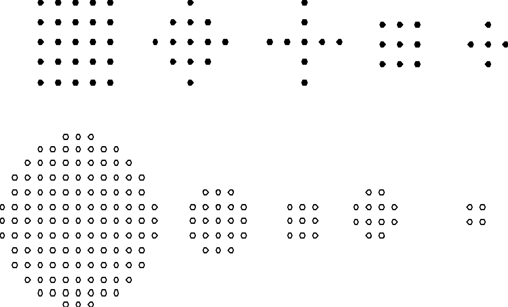

### 窗口选择

- **窗口**：线状、方形、圆形、十字形及圆环等。
- **方形或圆形窗口**：缓变的较长轮廓线物体为宜。
- **十字形窗口**：含有尖顶物体适用，窗口大小则以不超过中最小有效物体的尺寸为宜。
- **不宜采用中值滤波**：如果图像中点、线、尖角细节较多。

### 中值滤波主要特性

**输入不变性**:
在窗口内**单调增加或单调减少**的序列，一些周期性的序列，中值滤波存在着不变性，**输出信号仍保持输入信号不变**。

1. 对大的边缘高度，**中值滤波较邻域均值好**，对于较小边缘高度，两种滤波有很少差别。
2. 是非线性的。
3. 在抑制图像随机脉冲噪声方面有效，运算**速度快**，便于实时处理。
4. **去除孤立线或点干扰，而保留空间清晰度较平滑滤波为好**；但对**高斯噪声则不如平滑滤波。**

### 复合型中值滤波

对一些内容复杂的图像，可以使用复合型中值滤波。如: 中值滤波线性组合、高阶中值滤波组合、加权中值滤波以及迭代中值滤波等。

### 几种中值滤波线性窗口

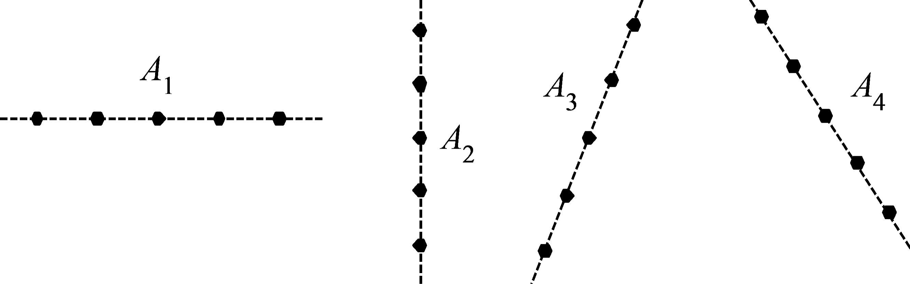
可选择图中的 4 种线状窗口 $A_1～A_4$ ，组合中值滤波, 可以使输入图像中各种方向的线条保持不变，而且又有一定的噪声平滑性能。

将几种窗口尺寸大小和形状不同的中值滤波器复合使用，只要各窗口都与中心对称，滤波输出可保持几个方向上的边缘跳变，而且跳变幅度可调节。其**线性组合方程**如下：

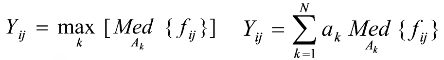

为了在一定的条件下尽可能**去噪**，又**保持细节**，采用**加权中值滤波**, 使**输入图像中任意方向的细线条保持不变**。也可以对中值滤波器的使用方法进行变化，保证滤波的效果，还可以和其他滤波器联合使用。

### 去噪声对比

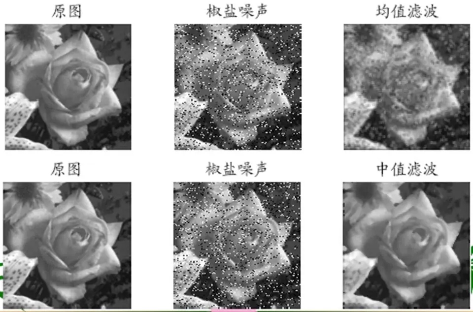

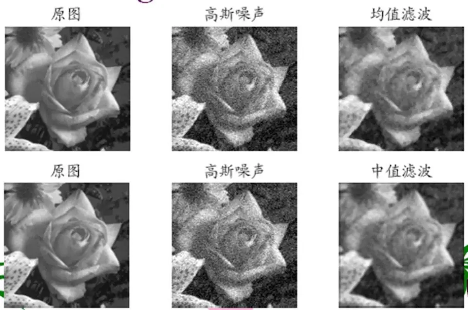

## N×N 中值滤波器实现

N 由用户给定；
计算 N×N 屏蔽窗口 (N=3， 5，7…) 内灰度的中值 u；
作 f (i，j)=u 处理。

实现步骤

1）取得图像大小、数据区，并把数据区复制到缓冲区中；
2）取得 N 值；
3）循环取得各点像素值；
4）对以该点像素为中心的 N×N 屏蔽窗口包括的各点像素值进行排序，得到中间值。5）把该点像素值置为中间值。

## 自己实现

简单的均值滤波和中值滤波

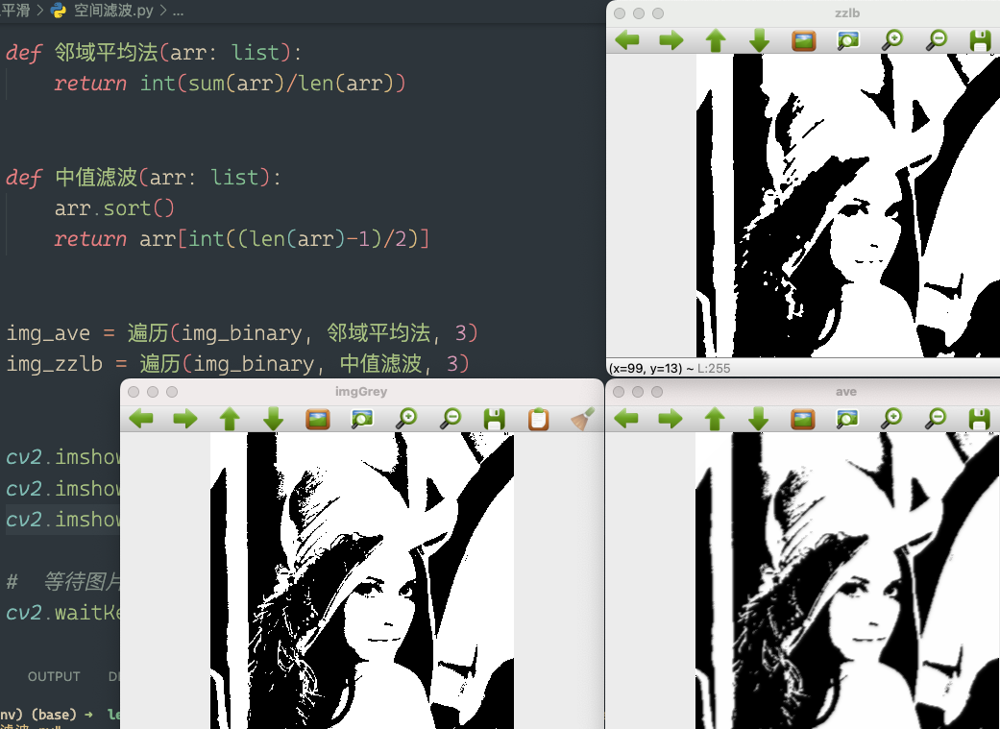

调整一下中值滤波的范围，立马就不一样了，分别是 3，5，7

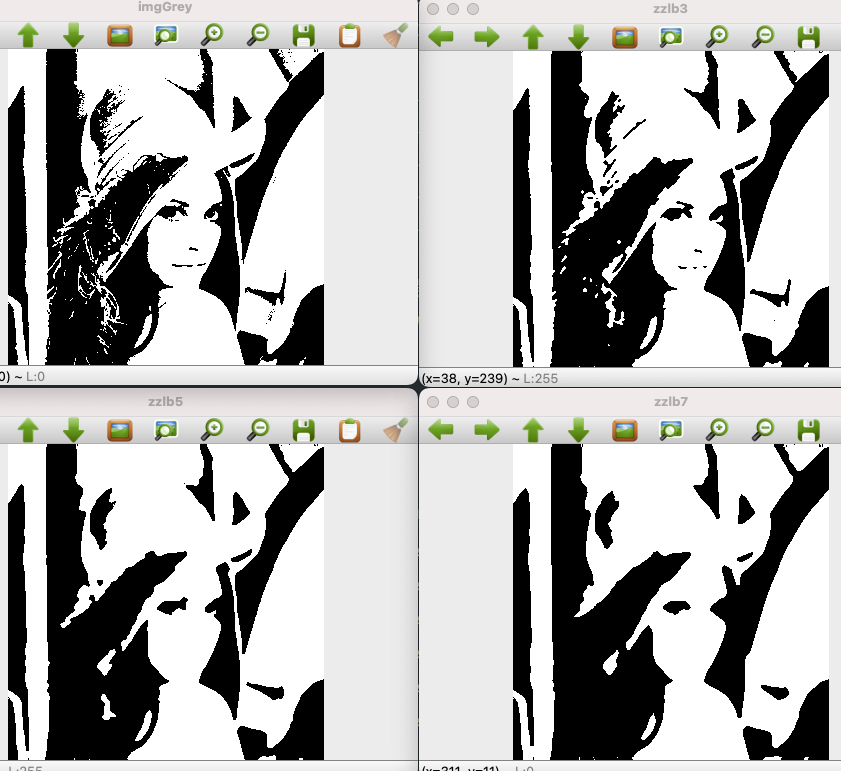

```python
# 获得待处理像素点的邻域，简单的 n*n 矩阵
def kenerl(img, x: int, y: int, n: int):
    a = int((n-1)/2)
    arr = []

    for j in range(x-a, x+a+1):
        for k in range(y-a, y+a+1):
            arr.append(img[j][k])
    return arr


# n 是奇数
def 遍历(img, func, n: int):
    a = int((n - 1)/2)
    arr = np.copy(img)
    (w, h) = arr.shape
    for x in range(a, w-a):
        for y in range(a, h-a):
            arr[x][y] = func(kenerl(arr, x, y, n))
    return arr


def 邻域平均法(arr: list):
    return int(sum(arr)/len(arr))


def 中值滤波(arr: list):
    arr.sort()
    return arr[int((len(arr)-1)/2)]


img_ave = 遍历(img_binary, 邻域平均法, 3)
img_zzlb = 遍历(img_binary, 中值滤波, 3)
```
