## 目的

**突出**图像中的细节，或者增强被模糊了的细节，**增强图像边缘**，便于提取目标物体的**边界**、对图像进行分割、目标区域识别、区域形状提取等，为图像理解和分析打下基础。

> 做减法，比较两个区域之间的不同，相邻像素点做差值

## 基本方法

锐化处理可以用空间微分来完成.

- **微分运算**
- **梯度锐化**
- **边缘检测**
  目前它已成为机器视觉研究领域最活跃的课题之一，在工程应用中占有十分重要的地位。

### 图像边缘类型

通常，**边缘上的灰度变化平缓，而边缘两侧灰度变化较快**。图像的边缘一般是指在**局部不连续**的图像特征。一般是局部**亮度变化最显著**的部分，灰度值的变化、颜色分量的突变、纹理结构的突变都可构成边缘信息。

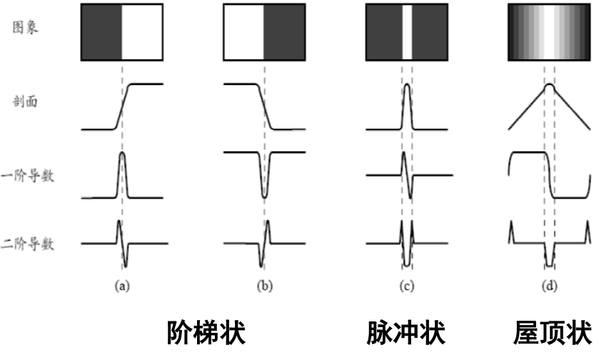

从数学上看

- 阶梯状，在斜坡处的的一阶导数不等于零，二阶导数等于零

我们最感兴趣的是**恒定灰度区域** (平坦段)、**突变的开头**与**结尾** (阶梯与斜坡突变) 以及沿着灰度级斜坡处的特性。**微分运算能够增强**边缘和其他突变 (如噪声), 消弱灰度缓慢变化的区域, 微分算子的响应强度与图像在该点的突变程度有关。

## 微分运算

因为像素值是离散的

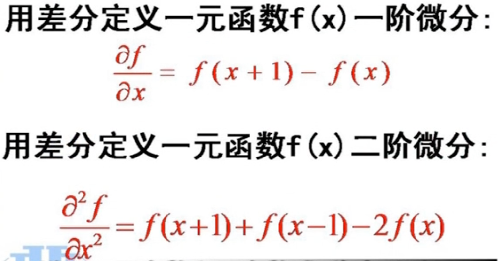

### 单向微分运算

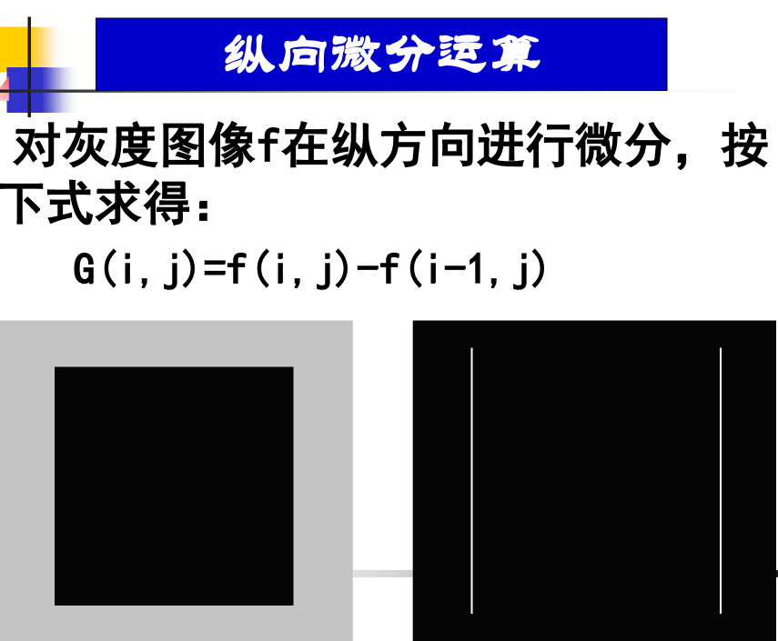 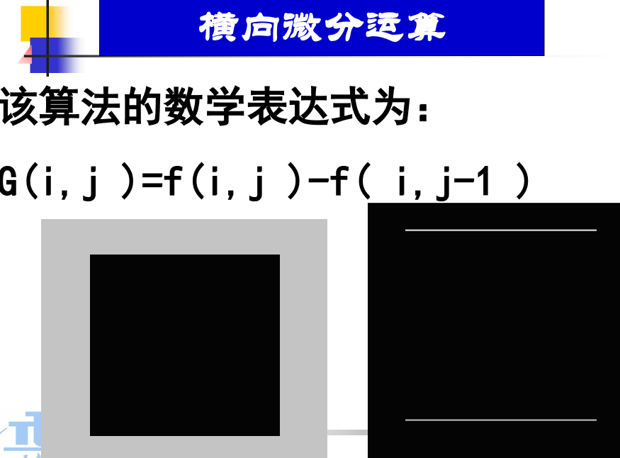

### 双向一次微分运算

对灰度图像 f 在**纵方向和横方向**两个方向进行微分。该算法是**同时增强水平和垂直方向的边缘。**

$G (i, j)=sqrt{[f (i, j)-f (i, j-1)]*[f (i, j)-f (i, j-1)]+[f (i, j)-f (i-1, j)]* [f (i, j)-f (i-1, j)]}$

- 相减的**结果反映了图像亮度变化率的大小**。
- 像素值**保持不变的区域，相减的结果为零**，即像素为黑；
- 像素值**变化剧烈**的区域，相减后得到较大的变化率，**像素灰度值差别越大**，得到的像素就越亮，图像的垂直边缘得到增强。

## 梯度运算

梯度是 1 个矢量，由分别沿 x 和 y 方向计算微分的结果构成。但是我们要一个**标量** 所以有两种算法

- 取最大值
- 先平方求和再开根号，（数学上的梯度方向对应最大变化率的方向上）

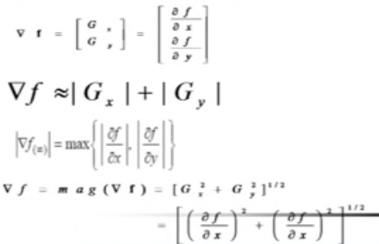

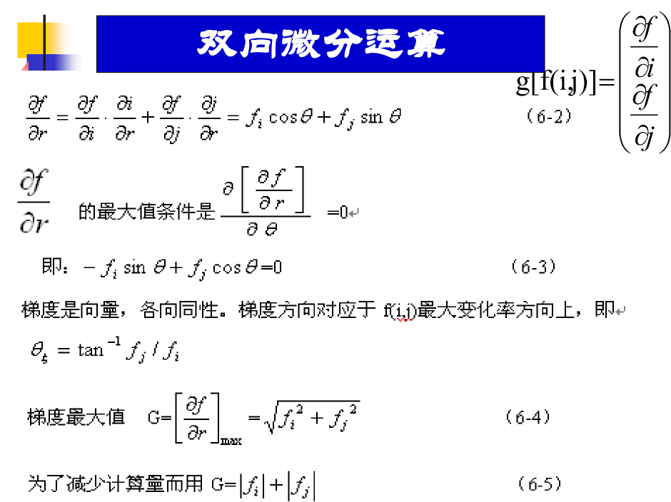

### Robert 提出的交叉微分算子

在对角线上求

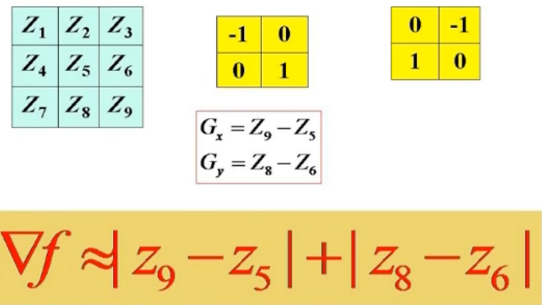

### Sobel 算子

既有平滑作用又有差分作用
，
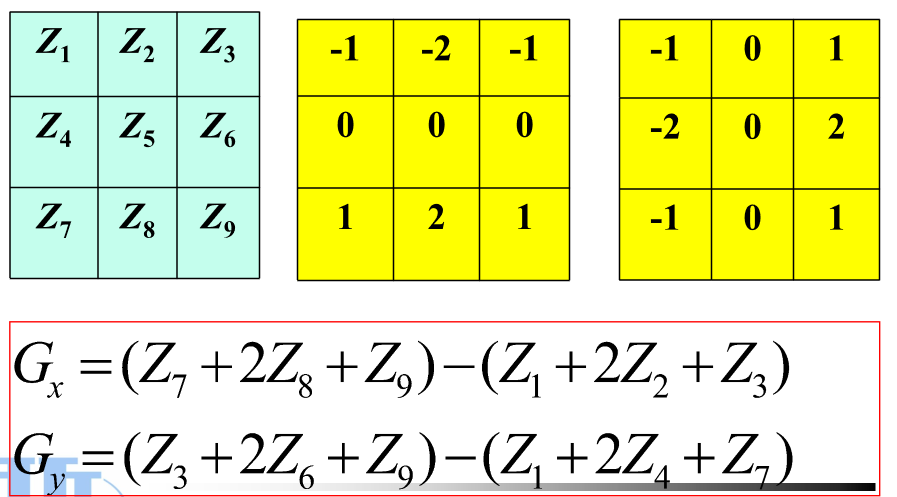
是求平均值

### Prewitt 算子

和上面的区别是系数不一样

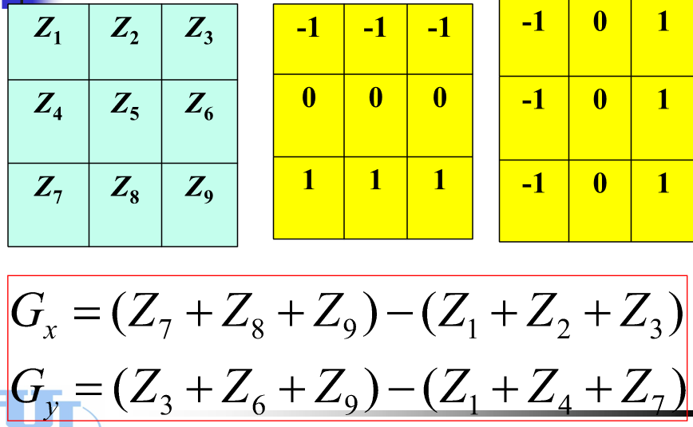

### 二阶微分——拉普拉斯算子

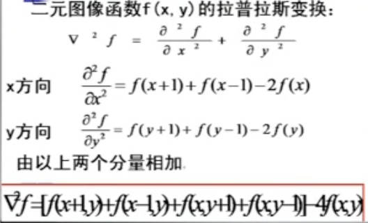
由公式系数，得出模版系数
拓展方式：

这两个是没有方向的

考虑两个斜对角模版
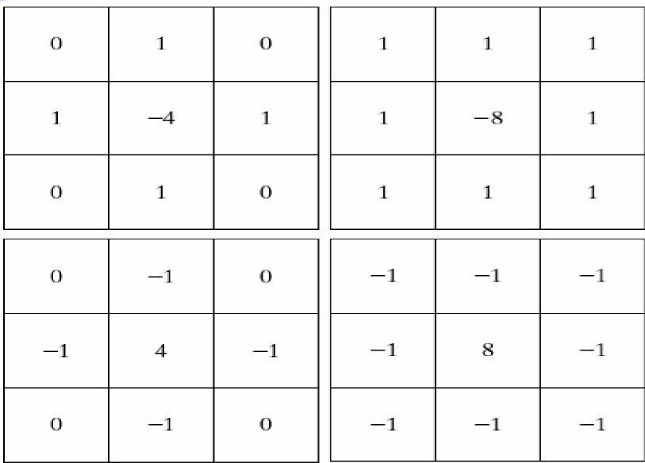

**强调突变, 弱化慢变**。产生一幅把浅灰色边线、突变点叠加到**暗背景中**的图像。

将原始图像和拉普拉斯图像叠加在一起的，保**持锐化处理的效果，又能复原背景信息。**

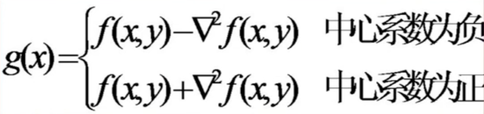

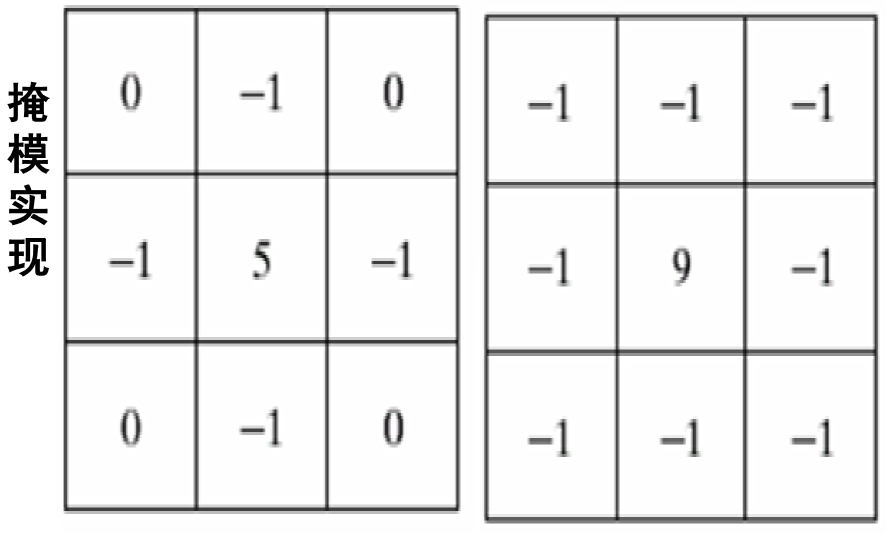

### 高斯-拉普拉斯（LOG）算子

高斯-拉普拉斯 (LOG) 算子是效果更好的边缘检测器，把高斯平滑器和拉普拉斯锐化结合起来，先平滑掉噪声，再进行边缘检测。

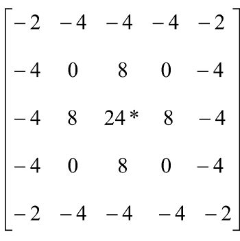

LOG 算子中心点的距离与位置加权系数的关系

### 高频提升滤波器

微分运算可用来求信号的变化率，具有加强高频分量的作用，微分处理后的图像**非常暗，不适用**。

如果**既要求图像的轮廓清晰**，又要求保持目标物体的内部灰度不变，这就是**高频提升滤波器**的目的。

**微分运算**会**使低频成分损失**很多, 而**高频成分突出**，为了使图像边缘清晰，内容完整保留，用下式：

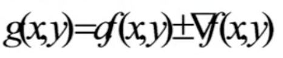

### 线性锐化滤波与高频提升滤波

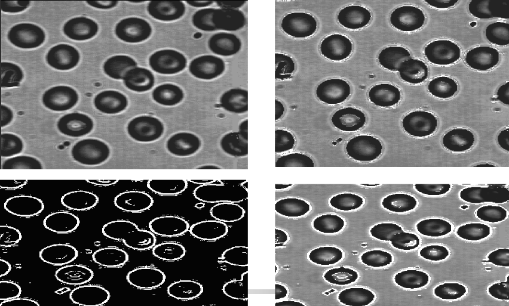

### 自适应检测

**采用多个边缘检测算子**，不同的检测算子模板采用不同的方向、不同的邻域导数，用求卷积的方法，计算每个模板，取最大值。

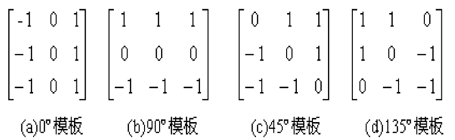

#### 实现步骤

- 将所有的边缘模板逐一作用于图像中的每一个像素，
- 产生最大输出值的边缘模板方向, 表示该点边缘的方向，
- 如果所有方向上的边缘模板接近于零，该点处没有边缘；
- 如果所有方向上的边缘模板输出值都近似相等，没有可靠边缘方向。

### Kirsch 边缘检测算子

以下 **8 个卷积核**组成了 Kirsch 边缘检测算子。图像中的每个点都用 8 个掩模进行卷积，所有 8 个方向中的**最大值**作为边缘幅度图像输出。

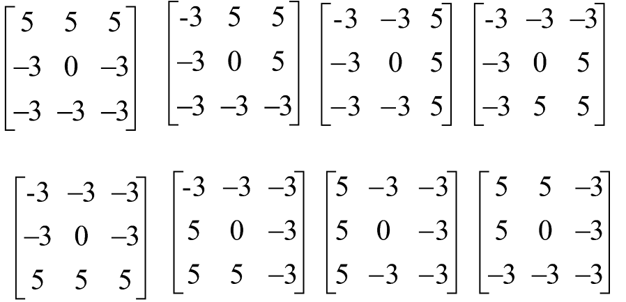

### 锐化算子小结

- **好的检测结果**：对边缘的错误检测率要低，在检测出真实边缘的同时，避免检测出虚假的边缘。
- **好的边缘定位精度**：标记的边缘位置要和图像上真正边缘的位置尽量接近。
- **对同一边缘要有低的响应次数**：有的算子会对一个边缘回产生多个响应。本来只有一个边缘点，可是检测出来会出现多个边缘点。**克服噪声的影响。**

### 算子比较

**Roberts 算子**：利用局部差分算子寻找边缘，**边缘定位精度较高**，但容易丢失一部分边缘，同时由于图像**没经过平滑处理**，因此**不具备能抑制噪声**能力。对陡峭边缘且含噪声少的图像效果较好。

**Sobel 算子和 Prewitt 算子**：先做加权平滑处理，再做微分运算，**平滑部分的权值有些差异**，对噪声具有一定的抑制能力，但不能完全排除**虚假边缘**。虽然这两个算子边缘定位效果不错，但检测出的边缘容易出现**多像素宽度**。

**Laplacian 算子**：是不依赖于边缘方向的**二阶微分算子**，对**阶跃型边缘点定位准确**，对噪声非常敏感，**使噪声加强，噪声能力差**，容易丢失一部分边缘的方向信息，造成一些不连续的检测边缘。

**LOG 算子**：先用高斯函数平滑滤波，后用 Laplacian 算子检测边缘，克服 Laplacian 算子抗噪声差的缺点，但同时也平滑掉比较尖锐的边缘，尖锐边缘无法检被测到。
高斯滤波器为低通滤波器，通频带越窄，对高频噪声抑制作用越大，避免了虚假边缘的检出，同时信号的边缘也被平滑了，造成某些边缘点的丢失。反之，通频带越宽，可以检测到更高频率的细节，对噪声的抑制能力下降，容易出现虚假边缘。高斯函数中**方差参数的选择很关键**，对图像边缘检测效果有很大的影响。

## 梯度锐化——图像处理

图像平滑往往使图像中的边界、轮廓变得模糊，为了减少影响，需要利用图像鋭化技术，使边缘变得清晰。常用的方法有：

- **直接以梯度值代替；**
- **辅以门限判断；** 超过一定的阈值，认为是边界，并加上一个的基础值，进行图像增强，其他像素不变
- **给边缘规定一个特定的灰度级;   给背景规定灰度级;** 超过一定的阈值，认为是边界，赋值规定的值，其他像素不变
- **根据梯度二值化图像.** 比较像素的**梯度是否大于 x**，是则将灰度值置为 255，否则将该像素的灰度值置 0。
