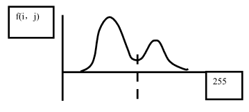

## 概述

处于图像处理的中间阶段

- 把图像分解成构成它的部件和对象的过程
- 有选择性定位感兴趣对象在图像中的位置和范围

**图像分割**：把图像分成各具特性的区域，如**目标或前景与背景**，选择性地定位感兴趣**目标**在图像中的位置和范围，提取出感兴趣目标的技术和过程。
人的视觉系统对图像分割是十分复杂的，也是相当有效的。但分割原理和模型都未搞清楚。

### 分割的基本策略

- 图像分割的基本策略，基于灰度值的两个基本特性
  - **不连续性**——区域之间
    - 边界分割法
    - 边缘连接分割法
  - **相似性**——区域内部
    - 阈值分割法
      - **直方图门限选择**
      - **半阈值选择图像分割**
      - **迭代阈值图像分割**
    - 面向区域的分割
    - 数学形态学图像处理
- 根据图像像素灰度值的**不连续性**
  - 先找到点、线（宽度为 1）、边（不定宽度）
  - 再确定区域
- 根据图像像素灰度值的**相似性**
  - 通过选择阈值，找到灰度值相似的区域
  - 区域的外轮廓就是对象的边

### 基本思路

- **从简到难，逐级分割**
- **控制背景环境，降低分割难度**
- **把焦点放在增强感兴趣对象，缩小不相干图像成分的干扰上。**

拿到原图后，先求梯度，找到 4 个梯度最大的区域，再选择合适的位置的区域，不能太高，最后再对每一个字符分割，之后才是识别

### 四种不同的方法

- **边缘检测**：检测出边缘，再将边缘像素连接，构成边界形成分割，找出目标物体的轮廓，进行目标的分析、识别、测量等。（第六章）
- **阈值分割**：最常用法。有直方图门限选择，半阈值选择图像分割，迭代阈值。
- **边界方法**：直接确定区域边界，实现分割；有边界跟踪法，轮廓提取法。
- **区域法**：将各像素划归到相应物体或区域的像素聚类方法；有区域增长法等。

## 图像阈值分割

阈值处理是一种区域分割技术，将灰度根据主观愿望分成两个或多个等间隔或不等间隔灰度区间，它主要是利用图像中要提取的目标物体和背景在灰度上的差异，选择一个合适的**阈值**，通过判断图像中的每一个像素点的特征属性是否满足阈值的要求来确定图像中该像素点属于目标区还是应该属于背景区域，从而产生二值图像。

### 直方图门限选择

**去背景，找前景**

阈值 T 可通过分析边缘检测输出的**直方图来确定**。假设，一幅图像只有物体和背景两部分组成，其灰度级直方图成明显的**双峰值**

假如，其灰度级直方图能呈现多个明显的峰值，比如有三个峰值，可取两个峰谷处的灰度值 T 1，T 2 作为阈值。同样，可将阈值化后的图像变成**二值化图像**。

#### 补充：对直方图处理

- 对噪声的处理
  - 对直方图进行平滑处理，如最小二乘法
- 通过边界特性选择阈值（**找到梯度最大的那一部分的像素直方图**）
  - 如果直方图的各个波峰很高、很窄、对称，且被很深的波谷分开时，有利于选择阈值
  - 为了改善直方图的波峰形状，我们只把区域边缘的像素绘入直方图，而不考虑区域中间的像素
  - **用微分算子处理图像**，使图像只剩下边界中心两边的值
  - 如果用**拉普拉斯算子**，不通过直方图直接得到阈值，方法是使用拉普拉斯算子过滤图像，将 **0 跨越点对应的灰度值设为阈值 T**

### 半阈值选择图像分割

上述方法，不论图像的直方图具有双峰还是多峰值，经过阈值化后均将原始灰度级多值图像变成**二值图像**，假如希望阈值后的图像只把图像的背景表示成二值图像（**即背景不是最白（用 1 表示）就是最黑（用 0 表示）**）而**图像中的物体仍为多值图像**。此时，可采用**半阈值技术**，把物体从背景中分离出来。

也很简单，就是不在阈值范围内的，保留原像素

### 迭代阈值图像分割

**基本思想**：选择一个阈值作为初始值，**按某种策略**不断地**迭代改进**，直到满足给定的准则。**自动输出**一个阈值。
在迭代过程中，关键是阈值改进策略，阈值改进策略要求：**快速收敛，新产生阈值优于上一次的阈值**。

#### 理论基础

迭代的方法产生阈值，可以通过程序自动计算出比较合适的分割阈值。其计算方法是这样的：

（1）选择阈值 T，通常可以选择图像的**平均灰度值**来作为初始阈值；
（2）通过初始阈值 T，把图像的平均灰度值分成两组 R 1 和 R 2；
（3）计算着两组平均灰度值 μ1 和 μ2；
（4） 重新选择阈值 T，新的 T 定义为 ：T=(μ1+μ2)/2;

循环做第二步到第四步，一直到两组的平均灰度值 μ1 和 μ2 不在发生改变，那么我们就获得了所需要的阈值。

- ? 这里的迭代是为了找什么，为什么不能一次性到位，（这个有点像二分法），我用程序算一下吧，或者从两边不断逼近

## 目标物体的轮廓提取

### 轮廓提取法

图像边缘是图像局部特性不连续性（灰度突变、颜色突变等）的反映，它标志着一个区域的终结和另一个区域的开始。二值图像的轮廓提取采用**掏空内部点**法：如果原图中有**一点为黑**，且它的 **8 个相邻点皆为黑**，则将**该点删除**。对于非二值图像，要先进行二值化处理。

1. 获取原图像的首地址，图像的高和宽。2) 开辟一块内存缓冲区。
2. 将像素点的 8 邻域像素读入数组中，如果 8 个邻域像素都和中心点相同，在内存缓冲区中将该像素点置白，否则保持不变。
3. 重复执行 3)，对每一个像素进行处理。

### 边界跟踪法

从图像中一个边界点出发，然后根据某种**判别准则搜索下一个边界点**，以此跟踪出目标边界。

- 确定边界的**起始搜索点**，起始点的选择很关键，对某些图像，选择不同的起始点会导致不同的结果。
- 确定合适**边界判别准则**和**搜索准则**，判别准则用于判断一个点是不是边界点，搜索准则则指导如何搜索下一个边缘点。
- 确定搜索的**终止条件**。

#### 跟踪准则

1）从左下角开始逐点扫描，当遇到边缘点时，则跟踪，直至跟后续点回到起始点（对于闭合线），或其后续点再没有新的后续点（对于非闭合线）为止。
2）如果为非闭合线，则跟踪一侧后，需从起始点开始朝相反的方向跟踪到另一尾点。
3）如果不止一个后续点，则按上述连接准则选择距离最近的点为后续点，另一次要的后续点作为新的边缘跟踪起点另行跟踪。
4）一条线跟踪完后，接着扫描下一个未跟踪点，直至所有边缘都跟踪完毕。

中心像素可以跟踪的方向有 8 个，对每个方向制定了方向编号及偏移量，选取图像的最左下方的像素点作为起始点。

- 当找到起始点，把该点记录下来；
  - 初始跟踪方向是：左上方 0 方向；
- 判断该点是否为目标点，是则把该点为跟踪的起始点；
  - 逆时针旋转 90 度，作为新的跟踪方向，继续检测该新的跟踪方向上的点。
- 若不是是目标点则沿顺时针旋转 45 度，一直到找到目标点。
  - 找到目标点后，在当前跟踪方向的基础上，逆时针旋转 90 度作为新的跟踪方向，用同样的方法跟踪下一个边界点；
- 直到回到起始点为止。

#### 实现步骤

1. 获得图像的首地址，图像的高和宽。
2. 开辟一块内存缓冲区，初始化为 255。
3. 将图像进行二值化处理。
4. 跟踪边界点，找到 1 个边界点, 就将内存缓冲区中该点置 0。需要判断一下初始值，如果为 0，说明之前已经是边界了，则完成了一个边界追踪，如果是 255，则表示不是边界。
   1. 默认的出发点和跟踪方向有关，旋转方向也有关
5. 按照跟踪准则，重复执行 (4)，直到回到初始点。

### 区域增长法

- **阈值分割法**: 很少考虑空间关系，使多阈值选择受到限制。
- **区域分割法**: 弥补这点不足，利用空间性质，认为**属于同一区域的像素应具有相似性**。
  - 传统的区域分割算法有: **区域增长法**和**区域分裂合并法**。该类方法在先验知识不足的图像进行分割, 有较好的性能。但是，空间和时间开销比较大。

依次用图像的每一个像素的灰度值和种子点相减，判断结果是否小于标准差，是则将该点和种子点合并，不是则保持像素点的灰度值不变。这样处理后的图像就是用区域分割法处理后的边缘分割图像。

考虑空间邻域象素之间的关系。
开始时确定一个或多个象素点作为种子，按某种相似性准则，增长区域，逐步生成具有某种均匀性的空间区域，将相邻的具有相似性质的象素或区域归并，从而逐步增长区域，直至没有可以归并的点或其它小区域为止。
区域内象素的相似性度量可以包括平均灰度值、纹理、颜色等信息。

- 选择合适的种子点
- 确定相似性准则 (生长准则)
- 确定生长停止条件

#### 实现步骤

1. 获取原图像的首地址，及高和宽。
2. 依次用图像的每一个像素的灰度值减去种子点，判断结果的绝对值是否小于阈值，阈值为 10。如果小于则将种子点赋给该像素点，否则灰度值保持不变。

### 区域分裂合并法

利用金字塔或四叉树数据结构的层次概念，将图像划分成一组任意不相交的初始区域，即从金字塔或**四叉树**数据结构的任一中间层开始，根据给定的均匀性检测准则进行分裂和合并这些区域，逐步改善区域划分的性能，直至最后将图像分成数量最少的均匀区域为止。

**确定分裂准则**: 若满足一致性准则， $P (R)=True$ ；否则， $P (R)=False$ .
**确定分裂方法**: 即如何分裂区域，使得分裂后的子区域的特性尽可能都满足一致性准则值。

1. 形成初始区域
2. 对图像的每一个区域 Ri，计算 P (Ri)，如果 P (Ri)=FALSE, 则沿着某一合适的边界分裂区域。
3. 重复步骤 2，当没有区域需分裂时，结束。

#### 区域合并

**区域合并**：把相邻的具有相似性的区域合为一个区域。
**重要运算是**：确定两个区域的相似性。
**评判相似性的方法**：基于区域的灰度值，或基于区域边界的强弱性等。简单的方法是比较它们的**灰度均值**。

1）使用某种方法进行图像的初始区域分割。
2）对于图像中相邻个区域，计算是否满足一致性, 若满足则合并为一个区域。
3）重复步骤 2，直到没有区域可以合并，结束。

#### 区域分裂合并

1. 设整幅图像为初始区域
2. 对每一区域 R，如果 P (R)=FLASE，则把该区域分裂成四个子区域
3. 重复上一步，直到没有区域可以分裂
4. 对图像中任意两个相邻的 R 1 和 R 2，如果 $P (R 1 UR 2)=TRUE$ ，则把这两个区域合并成一个区域。
5. 重复上一步，直到没有相邻区域可以合并，结束。

## 图像的测量

**主要求面积和周长**

在二值图像中, 相互连接的黑像素的集合成为一个黑区域，对黑区域处理的测量主要介绍:

- 二值图形的区域标志；
- 二值图形的小区域消除；
- 二值图形封闭域大小的计算；
- 二值图形的边界线跟踪；

### 二值图像区域标记

在二值图像中，相互联结的黑像素集合成为一个（黑）区域。
通过对图像内每个区域进行标记操作，求得区域的数目。
处理前的 f 是二值的，像素要么为 0 (黑)，要么为 255 (白),
处理后**每个像素的值即为其所处理区域的区域标号** (1,2,3,…)。

#### 标记准则

- 从左到右，从上倒下逐个像素扫描。
- 若该点的**左上、正上、右上及左前点**都不为物体，则标号加 1。
- **优先级依次**为右上点，正上点，左上点及左前点。**右上点的优先级最高，左前的优先级最低。**
- 若右上点为物体，则当前点标记和右上点相同的值。
- 若右上点不为物体，则判断正上点。
- **其中特别调整：** 当前点的**右上点及左前点为不同标记**，正上点和左上点不为物体，则**当前点标记同右上点置相同的值**。此时，从头到尾扫描图像，把所有标记相同的像素值都标记成与右上点同样的值。（认为是同一个物体）

> [!NOTE] 我很生气 😡，乱教，讲解对理解代码没有帮助，让我浪费了 4 个小时
> C++ 代码步骤，面向过程，一点都不好理解，不是按照标记准则，而是一个方向一个方向处理
> [第七章   第 3 讲   图像的测量\_哔哩哔哩\_bilibili](https://www.bilibili.com/video/BV1tx41147Tx/?p=32)
>
> 标记准则语义不明确，让我调试了半天，还是错误，最后对着像素点，整理了自己的思路，才做出来
>
> 出错的地方：
>
> 其中特别调整：当前点的右上点及左前点为不同标记，正上点**或**左上点不为物体，则当前点标记的左前同右上点置相同的值。
> ^area-flag

#### 实现步骤

1. 读入原图数据，存放在缓冲区内。
2. 根据输入的阈值进行二值化。
3. 从左到右，从上倒下，**依次检测每个像素，如果发现某像素点像素值为 0，则依次检测该点的右上、正上、左上及左前点共四个点的像素值，根据前面介绍的 8 个准则进行连通性的判断，并标识物体，将物体的像素值改为标号。**
4. 依次逐行检测至扫描结束。

### 二值图像的区域面积测量

在二值图像 f 中，通过对图像 f 内每个像素进行标记操作，将物体的像素值改为标号，求各种标号的总和，即求得不同区域的面积数目。

1. 调用标记统计函数，对图像进行标记, 划分成不同的连通区域。
2. 循环取得各点像素值，像素值就是标号。
3. 根据不同的标号，加到对应的数组。4) 弹出对话框，输出各个连通区域的面积（像素个数）。

### 二值图像的周长测量

在二值图像区域标记的基础上，物体的像素值改为标号，再采用**边界跟踪法**，跟踪各封闭区域边界线 (轮廓线) 的每个黑像素的标号，记录二值图像物体边界。

#### 实现步骤

1. 调用 biaoji () 函数，对图像进行标记, 划分成不同的连通区域。
2. 根据不同的像素值, 即不同的连通区，循环取得各点像素值的标号，搜索出一个发点，利用 7.3.2 节介绍的边界跟踪法，采用 Lunkuogenzong () 函数，找到出发点后，记录其坐标，再跟踪下一像素。保留循环得到的边界点，其余都置 255（白点）。
3. 根据不同的像素值, 即不同的连通区，依次执行第 2 步。
4. 把缓冲区的数据返回到原数据区。
5. 调整连通边界区，计算每个连通边界区的周长（像素个数）。
   1. ? 如果是斜对角是不是应该计算 $\sqrt{2}$
6. 弹出对话框，输出各个边界连通区域的像素个数

### 二值图像的小区域消除

在二值图像区域标记的基础上，通过对图像 f 内每个标记的区域进行计算，求得总区域的数目。并求得每个区域的像素个数。当二值图像 f 的**某区域面积 (像素数) 在阈值以下时**, 则消去该区域，全部置为 255 (白)，由此得到新图形。

### 投影量的计算

1. **水平投影**实现步骤：
   1. 图像二值化，物体为黑，背景为白。
   2. 循环各行，依次判断每一列的像素值是否为黑，统计该行所有黑像素的个数。设该行共有 M 个黑像素，则把该行从第一列到第 M 列置为黑。
2. 垂直投影
   1. 图像二值化，物体为黑，背景为白。
   2. 循环各列，依次判断每一行的像素值是否为黑，统计该列所有黑像素的个数。设该列共有 M 个黑像素，则把该列从第一行到第 M 行置为黑。

根据投影定位需要识别的区域，再进行切割

### 纹理分析

- **纹理**就是指在图像中反复出现的局部模式和它们的排列规则。
- **纹理特征**反映了物体本身的属性，有助于将两种不同的**物体区别**开来。
- 希望通过对图像的纹理分析获得关于景物纹理特征和结构的**定量分析**描述和解释，这就是图像纹理分析的任务。

- 是**图像像素灰度级或颜色的某种变化**，反复出现**纹理基元和它的排列规则**，而且这种变化是**空间统计**相关的。构成纹理特征的两个要素：
  - **① 纹理基元**：由一定的形状和大小多种图像基元的组合叫纹理基元。
  - ② 纹理是由纹理基元排列组合而成的。基元排列的疏密，周期性，方向性等的不同，能使图像的外观产生极大地改变。

指通过一定的图像处理技术**抽取出纹理特征**，获得纹理的**定量或定性**描述的处理过程。它首先**从像素出发**，检测出**纹理基元**，并找出纹理基元排列的信息，建立纹理基元模型。
**纹理分析**：检测出纹理基元；获得有关纹理基元排列分布方式的信息。

### 方法

- ① 统计方法：
  - (a) **空间域**：基于统计图像像素灰度级的分布状况，如利用直方图。
  - (b) 频域：首先将图像变换到傅里叶变换的频域中然后抽取相应的象征量。
- ②**结构方法**：用于印刷或砖花样等一类纹理基元及其排列较规则的图像。

#### 直方图统计特征分析法

**选择**合适的邻域大小；
对每一个像素，**计算**出其邻域中的灰度**直方图**；
**比较**求出的直方图与**已知的**各种纹理基元或含由纹理基元的邻域的**直方图间的相似性**;
若相似，说明存在已知的纹理基元。

设 h 1 (z) 和 h 2 (z) 为两个区域的灰度直方图
**直方图的均值** \ **直方图的方差**

$h_1(x)$ 表示从 0-255 的所有灰度值

**Kolmogorov—Smirnov 检测**

若 $|KS-SD|$ 在阈值内，h 1 (z) 和 h 2 (z) 是相似的

#### 边缘方向直方图分析法

**灰度级直方图不能反映图像的二维灰度变化**，图像边缘包含有大量的二维信息，**取沿着边缘走向的像素的邻域，分析其直方图**，若在直方图上的某一个灰度范围内具有尖峰，就可以说明在这个范围内，纹理所具有的方向性。因此，单纯的分析边缘方向的直方图可得到有关纹理的一些信息。

- & 我的理解是统计水平方向和垂直方向有几个边界个数

#### 图像自相关函数分析法

$P(x,y)$ 是偏移量，指定的参数， 可以看是否有周期性，

- 利用 p (x, y) 随 x, y 大小而变化的规律，可以描述图像的纹理特征。
- 自相关函数 p (x, y) 随 x、y 大小而变化，与图像中纹理粗细的变化有着对应的关系。若纹理较粗，则 p (x, y) **随 d 增加而下降**的速度**较慢**；若**纹理较细**，则 p (x, y) 随 d 增加而下降的速度较快。
- 随着 d 的继续增加，p (x, y) 会呈现某种周期性变化，这种周期性可以反映纹理基元的排列规则。

#### 灰度共生矩阵特征分析法

- **灰度直方图**：因为各个像素的灰度是独立进行处理，所以不能很好地反应像素之间的**灰度级空间相关性**的规律。
- 相邻某一间隔长度的两个像素，它们之间要么具有相同的灰度级，要么具有不同的灰度级，若能找出这样两个像素的联合分布的统计形式，对于图像的纹理分析很有意义。

灰度共生矩阵被定义为从灰度为 i 的像素点出发，离开某个固定位置（相隔距离为 d，方位为）的点上灰度值为的概率，即，所有估计的值可以表示成一个矩阵的形式，以此被称为灰度共生矩阵。**对于纹理变化缓慢的图像，其灰度共生矩阵对角线上的数值较大；而对于纹理变化较快的图像，其灰度共生矩阵对角线上的数值较小，对角线两侧的值较大**。由于灰度共生矩阵的数据量较大，一般不直接作为区分纹理的特征，而是基于它构建的一些统计量作为纹理分类特征。Haralick 曾提出了 14 种基于灰度共生矩阵计算出来的统计量：即：能量、熵、对比度、均匀性、相关性、方差、和平均、和方差、和熵、差方差、差平均、差熵、相关信息测度以及最大相关系数。

为从灰度为 i 的像素点出发，离开某个固定位置 δ=(DX, DY) 的另一个像素点的同时发生的灰度为 j ,定义这**两个灰度**在整个图像中**发生的概率**（或者频率）。

下图显示了如何求解灰度共生矩阵，以（1，1）点为例，GLCM（1，1）值为 1 说明只有一对灰度为 1 的像素水平相邻。GLCM（1，2）值为 2，是因为有两对灰度为 1 和 2 的像素水平相邻。

这是水平方向的

- > 我感觉和微分运算有类似之处

其他特征量

#### 定量分析

将其灰度进行正规化处理；
用前述的梯度算子，可以得到它的梯度图像。
经过正规化处理，即可得到 2 个正规化矩阵

灰度-梯度共生矩阵定义如下：

灰度为 i（在矩阵中的位置为第 i 行），
梯度为 j（在矩阵中的位置为第 j 行）的总像素点数。进行正规化处理。

