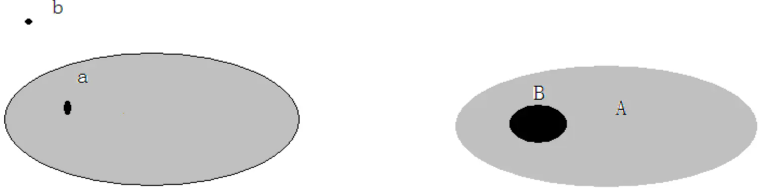
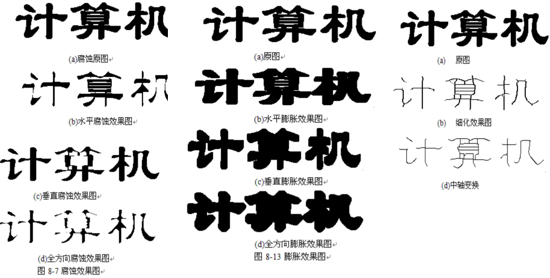
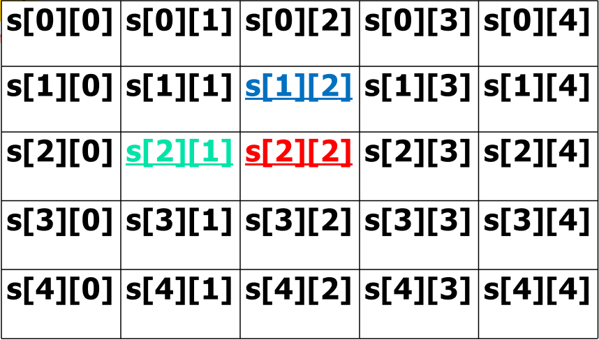

## 形态学基本概念

- 基本思想：用一定**形态**的**结构元素**去量度和提取图像中的**对应形状**，达到分析和识别目的。
- **可用于图像处理的各个方面**，包括图像分割、特征抽取、边界检测等。
- 对图像处理的理论和技术产生了**重大影响**，已经构成一种新的图像处理方法和理论，成为一个**重要**研究领域。

### 形态学数学基础

数学形态学的**数学基础**和**所用语言**是**集合论**，具有完备的数学基础。数学形态学的应用可以**简化**图像数据，保持它们基本的形状特性，并除去不相干的结构。
元素和集合：



1. 交集、并集和补集
2. 包含、击中与击不中
   1. B 击中 A ：B 的一部分在 A 的集合内

## 形态学作用



## 基本方法

**结构元素**: 形态学变换中的基本元素，是为了**探测**图像的某种结构信息而设计的特定形状和尺寸的**图像**，称为收集图像结构信息的探针。

**结构元素有多种类型**：如圆形、方形、线型等，可携带知识（形态、大小、灰度和色度信息）来探测、研究图像的结构特点。

二值形态学中的**运算对象是集合**。
设 X 为图像集合，**B 为结构元素**，数学形态学运算是用 B 对 X 进行操作。需要指出，实际上**结构元素本身也是一个图像集合。**

## 形态学算子

**形态学运算包括**：二值腐蚀和膨胀、二值开闭运算、骨架抽取、击中击不中变换等。

**形态学 4 个基本算子**：**膨胀、腐蚀**、开启和闭合组成。这些基本运算还可推导和组合成各种数学形态学实用算法。

### 腐蚀运算

腐蚀: 是将图像 X 中每一与结构元素 B 全等的子集 B+x 收缩为点 x。
**腐蚀作用：消除物体边界点**, 使边界向内部**收缩**，可以把**小于结构元素的物体去除**。选取不同的大小的结构元素，**去除**不同大小的物体。如两个物体间有**细小的连通**，通过腐蚀可将两个**物体分开**。

#### 基本方法


- S--腐蚀后的二值图像集合；
- B--腐蚀的结构元素，每一个元素取值为 0 或 1，它可以组成任何一种形状的图形，在 B 图形中有一个中心点；
- X--经过二值化后的像素集合。
- 用 B 来腐蚀 X 得到的集合 S，**S 是由 B 完全包括在 X 中时 B 的当前位置的集合**。

通常是拖动结构元素在 X 域移动，在每一个位置上，当结构元素 B 的中心点平移到 X 图像上的某一点 (x, y)。
**如果结构元素内的每一个像素都与以 (x, y) 为中心的相同邻域中对应像素完全相同**，那么就保留 (x, y) 像素点；**对于不满足条件的像素点则全部删除**，达到边界向内收缩效果。


#### 腐蚀作用

腐蚀: 消除物体边界点。

- 结构元素取 3×3 块，使边界减少一个像素。
- 小于结构元素的物体 (毛刺、小凸起) 去除。
- 选取不同大小结构元素，在原图像中去掉不同大小的物体。
- 如果两个物体之间有细小的连通，当结构元素足够大时，可以将两个物体分开。

### 膨胀运算

作用：与腐蚀相反。

对二值化物体**边界点扩充**, 将与物体接触的**所有背景点合并到该物体**中，**使边界向外部扩张**。

如果两个物体之间的距离**比较近**，会把两个物体连通到一起。

对**填补**图像分割后物体中的空洞有用。


通常是拖动结构元素在 X 图像域移动，在每一个位置上，当结构元素 B 的中心点平移到 X 图像上的某一点 (x, y)，如果结构元素的像素与目标物体至少有一个像素相交，保留 (x, y) 像素点，达到边
界向外扩张。

#### 膨胀作用

如果结构元素为一个圆盘：

膨胀：填充图像中的小孔 (比结构元素小的孔洞) 及图像边缘处的小凹陷部分。
腐蚀：消除图像边缘小的成分，并将图像缩小，从而使其补集扩大。

膨胀和腐蚀：并**不互为逆运算**，**可以级连结合使用**。

## 图像开启与闭合

由膨胀和腐蚀两个运算的复合与集合操作（并、交、补等）组合成的所有运算构成。

开运算和闭运算依据腐蚀和膨胀的**不可逆性**，演变而来的。

**开运算**: 先对图像**腐蚀**后**膨胀**。
**闭运算**: 先对图像**膨胀**后**腐蚀**。

**使用同一个结构元素**。

### 开运算

**开运算**：能够**去除孤立的小点**，毛刺和小桥 (即连通两块区域的小点)，**消除小物体**、平滑较大物体的边界，同时并不明显改变其面积。不过这一恢复不是信息无损的，即它们通常不等于原始图像。


开运算: 先腐蚀，后膨胀

对于腐蚀运算：**如果 B 上的所有点都在 X 的范围内，则该点保留**，否则将该点去掉。
对于膨胀运算：**如果 B 上有一个点落在 X 的范围内，则该点就为黑**。

#### 开运算作用

经过开运算后，能够去除孤立的小点，毛刺和小桥 (即连通两块区域的小点)，平滑较大物体的边界，同时并不明显改变面积。

### 闭运算

闭运算是通过对腐蚀和膨胀的另一种不同次序的执行而得到的。

**闭运算：先膨胀后腐蚀**，其功能是用来**填充物体内细小空洞**、连接邻近物体、平滑其边界，同时不明显改变其面积。


#### 闭运算作用

闭运算是通过对腐蚀和膨胀的另一种不同次序的执行而得到的，闭运算是**先膨胀后腐蚀**的过程，其功能是用来**填充物体内细小空洞、连接邻近物体**、平滑其边界，同时不明显改变其面积。

经过闭运算后，断裂的地方被弥合了。闭运算能够填平小孔，弥合小裂缝，而总的位置和形状不变。

### 图像细化

**细化技术**: 把一个平面区域简化成图的结构形状表示法。

**骨架**: 一种细化结构，它是目标的重要拓扑描述，具有非常广泛的应用。在图像识别或数据压缩时，经常用细化结构，例如，在识别字符之前，往往要先对字符作细化处理，求出字符的细化结构。

细化：目的是将图像的骨架提取出来的同时，保持图像细小部分的连通性，特别是在文字识别，地质识别，工业零件识别或图像理解中，先对被处理的图像进行细化有助于**突出形状特点和减少冗余信息量**。

细化过程: 求一图像骨架的过程。
骨架: 重要拓扑描述，指骨骼部分。
长方形骨架: 长方向上的中轴线；
正方形骨架: 中心点；
圆骨架: 圆心;
直线骨架: 自身;
孤立点骨架: 自身。

**对中心点处理**


#### 细化原则

在细化一幅图像 X 时应满足两个条件：
第一，在细化的过程中， X 应该有规律地缩小；
第二，在 X 逐步缩小的过程中，应当使 X 的连通性质保持不变。

**实际应用**：通常选择一组结构元素对，不断在这些结构对中循环，如果所得结果不再变化，则终止迭代过程，随着迭代的进行，集合也**不断细化**。
**结构对的选择**：**仅受结构元素不相交的限制**。事实上，每一个 Bi (i=1, 2, …, N) 都可以是相同的结构对，**即在不断重复的迭代细化过程使用同一个结构对**。

#### 代码实现

另一种更好的实现方式 [[细化-骨架)

设置一个 `5*5` 的邻域 S 模板；S 模板中各个位置上的取值取决于模板所对应图像中不同位置的像素，如果 S 模板某一个位置上所对应的像素值为白，模板上该位置赋为 0，否则赋为 1。

把目标点变 1，非目标点为 0，方便进行与运算


没有用到 `5*5` ，展示那么多干什么，不还是 `3*3` 么

```

N（s[2][2]）表示以 s[2][2]为中心的 3×3 邻域内目标像素（即黑点）的个数。

取其中的 3×3 邻域以 s[2][2] 为中心点，则 T (s[2][2]) 表示序列：S[1][2] -》s[1][2] 0->1 的变化次数。
取其中的 3×3 邻域以 s[1][2] 为中心点，则 T (s[1][2]) 表示序列：S[0][2] -》s[0][2] 0->1 的变化次数。
取其中的 3×3 邻域以 s[2][1] 为中心点，则 T (s[2][1]) 表示序列：S[1][1] -》s[1][1] 0->1 的变化次数。


条件1：2≦N(s[2][2])≦6；
条件2：T(s[2][2]))=1；
条件3：s[1][2]* s[2][1]* s[2][3] = 0 同时 T(s[1][2])!=1;
条件4：s[1][2]* s[2][1]* s[3][2] = 0 同时 T(s[2][1])!=1。

同时满足以上4个条件，则删除该点，否则保留，重复判断像素点直至没有点可以删除。

```

**细化过程**就是判断每一个二值化的图像像素点是否满足以上 **4 个条件，满足则删除该点**，重复判断直至所有点都不能删除为止。

- & 理解一下，就上图 6 个可以删，不可以删的条件。上面奇怪的条件可以等价成 8 个不同边界的击中击不中模板，，为了能快速计算，才压缩成 4 个奇怪的条件
  - [二值形态学之击中击不中变换](https://cloud.tencent.com/developer/article/2161605)
  - 

### 图像粗化

粗化从数学形态学的角度看，是与细化像对应的。因此也可以利用击中击不中变换来表示，粗化的数学表达式是：


从公式可以看出粗化实际上是击中击不中变换结果与原始图像的并集，从实现上说就是通过对**图像的补集进行细化**而得到的。

### 中轴变换

中轴变换与细化不同：
中轴骨架在**拐角处延伸**到了边界。
细化则不是，**细化对于拐角的骨架不予提取**。

中轴变换的算法和细化的算法有些**相似**，也是采取逐次去除边界的方法来进行的，同时中轴变换也不能破坏图像的连通性。具体的算法是对图像进行两次删除，每次删除应满足 4 个条件。

```
第一次删除的条件：
条件 1：2≦N (s[2][2])≦6；
条件 2：T (s[2][2])=1；
条件 3：s[1][2]* s[2][1]* s[3][2]=0；
条件 4：s[2][1]* s[2][3]* s[3][2]=0。

第二次删除的条件：
条件 1：2≦N (s[2][2])≦6;
条件 2：T (s[2][2])=1;
条件 3：s[1][2]* s[2][1]* s[2][3]=0；
条件 4：s[1][2]* s[2][3]* s[3][2]=0。
```

**先判断第一组的 4 个条件**，如果有像素点满足全部条件则删除该点，循环执行直至全部像素点；
**再用处理后的图像进行第二次判断**，如果有像素点满足第二组的 4 个条件，删除该点，循环执行直至全部像素点。**重复**，直至没有点可以删除。

## 小结

数学形态学的运算以腐蚀和膨胀这两种基本运算为基础，引出了其它几个常用的数学形态运算，开运算、闭运算、击中、细化和粗化。用这些运算及其组合可以进行图像形状和结构的分析及处理，包括图像分割、特征抽取、边界检测、图像滤波、图像增强和恢复等方面的工作。
