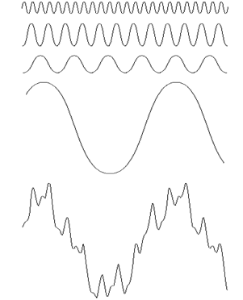
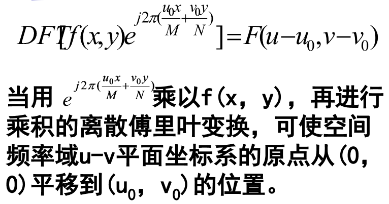
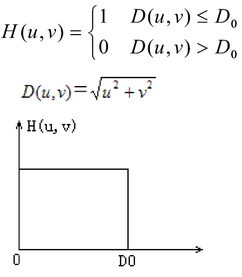
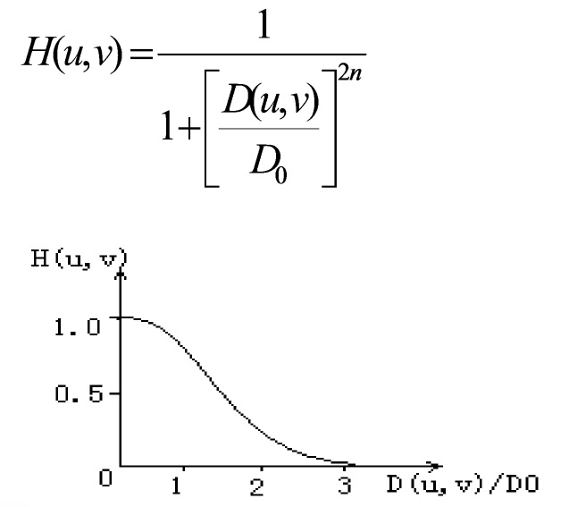
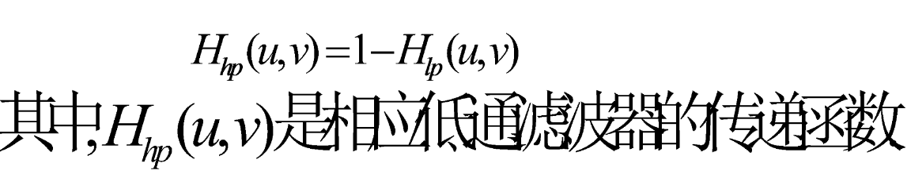
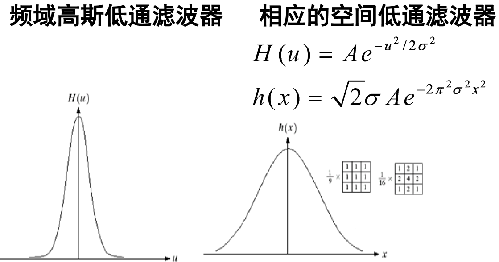

## 概述

**任意波形**：可分解为正弦波的加权和。
**复杂函数**：可用简单的正弦和余弦函数表示。

**图像变换**：图像从空域变换到其它域（如频域）的数学变换。
**图像变换的作用**

1.  方便处理
2.  便于抽取特性

==傅立叶变换的具体内容就不展开了，只展示一下效果==

### 常用的变换

1. 傅立叶变换
   Fourier Transform
2. 离散余弦变换
   Discrete Cosine Transform

## 图像的正交变换

**任意周期波形**：可分解为正弦波的加权和。
**非周期函数**：可用正弦和/或余弦乘以加权函数的积分表示。
用傅立叶级数或变换表示的函数特征可以通过傅立叶**反变换重建，不丢失任何信息**。

**要解决两个问题**：

1）在数学中进行傅立叶变换为**连续模拟信号**，计算机处理是**数字信号**（图像数据）；
2）数学上采用**无穷大**概念，而计算机只能进行**有限次**计算。

将受这种限制的傅立叶变换称为**离散傅立叶变换**（Discrete Fourier Transform，**DFT**)。

**傅立叶变换的 F (u) 的值由 f (x) 函数所有值的和组成.F (x) 的值与各种频率的正弦值和余弦值相乘。**

F (u) 值的范围覆盖的域（u 的值）称为频率域，因为 u 决定了变换的频率成分.

傅立叶变换可看成“数学的棱镜”，将函数基于频率分成**不同的成分**. 使我们能够通过**频率成分**来分析一个函数。

### 二维傅立叶变换

**原点处的傅立叶变换等于平均灰度级**

二维序列 f (x，y) 的**频谱**（傅立叶幅度谱）、**相位谱**和**能量谱**（功率谱）：

傅里叶变换在数学上需要满足如下狄利克莱条件：

(1) 具有有限个间断点；
(2) 具有有限个极值点；
(3) 绝对可积。

### 作用

（1）可以得出信号在**各个频率点上的强度**。
（2）可以将**卷积运算化为乘积运算**。
（3）傅氏变换和线性系统理论是进行图像恢复和重构的重要手段。
（4）傅立叶变换能使我们从空间域与频率域两个不同的角度来看待图像的问题，有时在空间域无法解决的问题在频域却是显而易见的。

### 性质

- 共轭对称性
- 加法定理
- 位移定理
- 相似性定理
- 卷积定理
- 能量保持定理
  - 变换函数与原函数有相同的能量

#### 傅立叶变换 —相似定理

一个“窄”的函数有一个“宽”的频谱

#### 傅立叶变换—旋转不变性

时域中离散函数旋转 θ 角度，离散傅立叶变换函数也将旋转同样的角度。例如旋转 45 度。

#### 傅立叶变换—平移性

傅立叶变换的原点 (即 F (0,0)) 移到中心点（u=M/2, v=N/2）：
在进行傅立叶变换之前用 (-1) x+y 乘以输入的图像函数，为确保移动后的坐标为整数，要求 M, N 为偶数。

#### 傅立叶变换 —可分离性

二维傅立叶变换可通过**二次一维傅立叶变换**完成，即第一次先对 y 进行一维傅立叶变换。

#### 傅立叶变换—卷积定理

在空间域里面的卷积等于频率域里面的乘积

#### 傅立叶变换在图像中的应用

**Fourier 变换系数**：表示各个频率点上的幅值。
**变换后的图像**：中间部分为低频部分，反映景物概貌的特性，越靠外边频率越高，反映细节。

可以在 Fourier 变换图中，选择需要**高频**或是**低频**滤波进行滤波

### 离散余弦变换（DCT）

**余弦函数**：是一种可分离的变换。
DCT 除了具有一般的正交变换性质外，基向量能很好地描述语音和图像信号的相关特征，被认为是一种准最佳变换。
视频压缩编码的国际标准把 DCT 作为其中的一个基本处理模块。

#### 二维离散余弦变换（DCT）

(a) 原图 (b) 离散余弦变换效果图

## 频域低通滤波

在空间域需要卷积操作，在频率域里进行乘积操作就行

$H (u, v)$ 被称为滤波器：在变换中抑制某些频率而其他频率不受影响。
输出图像：

$G(u,v) = H (u, v)F(u,v)$

被滤波的图像可以通过傅立叶反变换得到:

被滤波的图像 $=\Psi ^{-1}[G(u,v)]$

在傅立叶变换中,
**低频：为了显示平滑区域**中总体灰度级，采用低通滤波器。
**高频：为了突出显示**决定图像细节部分, 如边缘和噪声，采用高通滤波器。

### 理想低通滤波器

在半径为 $D_0$ 的圆内，所有频率没有衰减地通过滤波器，而在此半径的圆之外的所有频率被完全衰减掉。

频率矩形的中心在 (u, v)=(M/2, N/2)

会有**振铃现象**产生。圆形的会产生圆形波纹，方形会产生方形波纹

### 梯形低通滤波器

梯形滤波器的处理效果是介于理想低通滤波器和具有平滑过渡带滤波器之间。

### 布特沃斯低通滤波器

通带与阻带之间没有明显的跳跃，有一个平滑过渡带。图像模糊程度会大大减少。经它处理的图像将**不会有振铃现象**产生。

### 巴特沃思低通滤波器 （BLPF）

BLPF 变换函数在通带与被滤除的频率之间没有明显的截断. 截断频率的位置位于 H (u, v)=0.5 的点，**一阶的 BLPF 无振铃**, 二阶中振铃通常很微小, 但阶数增高时振铃便成为一个重要因素.

### 指数低通滤波器（高斯低通滤波器）

与 BLPF 处理的图像相比，要模糊一些；由于在其传递函数中也有较平缓的过渡带，所以图像中没有振铃现象出现。

式中的 n 是决定衰减率的系数

### 横向对比

### 低通滤波器

确定截止频率方法：计算包含图像总功率值 $P_T$ 特定量的圆环. 对于不同的低通滤波器, 通过研究其在具有相同的时所表现的不同特性来进行比较。

根据对保留能量的要求，确定某种滤波器的截止频率，进行比较，选择一种滤波器。

## 频域高通滤波

由于在灰度级的边缘处比其他地方的灰度值急剧变化，与高频成分有关，图像的锐化能够在频率域用高通滤波处理实现.

高通滤波器的传递函数：
$$H_{hp}(u,v)=1-H_{lp}(u,v)$$

### 理想高通滤波器

相对于理想低通滤波器，将以 D 0 为半径的圆周内的所有频率置零, 而毫不衰减地通过圆周外的任何频率. IHPF 通用具有振铃性质

### 梯形高通滤波器

### 巴特沃思高通滤波器

巴特沃思型高通滤波器比理想高通滤波器更平滑, 截止频值越高, 越平滑。

### 指数高通滤波器（高斯高通滤波器）

## 空域滤波与频域滤波的对应关系

- 指定的频率域滤波器和空间域滤波器具有相同的尺寸.
- 如果两个滤波器具有**相同尺寸**, 通常在**频率域**进行滤波计算更为有效.
- **空间域**更适用于更小的滤波器.
- 可以在频率域指定滤波器, 做反变换, 然后在空间域使用结果滤波器作为在空间域构建更小的滤波器模板的指导.

## 钝化模板滤波

钝化模板：可由一幅图像减去其自身模糊图像构成。

采用频率技术，从图像自身减去低通滤波后的图像而得到高通滤波的图像

### 高频提升滤波

高频提升过滤通过将 f (x, y) 乘上一个大于 1 的常数 Q 产生：

高频提升过滤也可由混合滤波器直接执行：

